AssettoServer Hub 内置了一个 Discord 机器人，具有以下功能：
* 将 Steam 账户关联到 Discord 账户
* 将 Discord 身份组映射为 AssettoServer 用户组（示例用例：基于 Discord 身份组的白名单）
* 将 AssettoServer 用户组映射为 Discord 身份组（示例用例：根据计时排行榜分配身份组）
* 在 Discord 中发布服务器状态

## 设置
* 访问 [Discord Developer Portal](https://discord.com/developers/applications/) 并创建一个新应用程序。你输入的名称将成为机器人的初始用户名。
* 在左侧点击 `Bot`。
* 点击 `Add Bot` 并确认。
* 取消勾选 `Public Bot`。
* 确保勾选了 `Server Members Intent`。

机器人页面应如下所示：

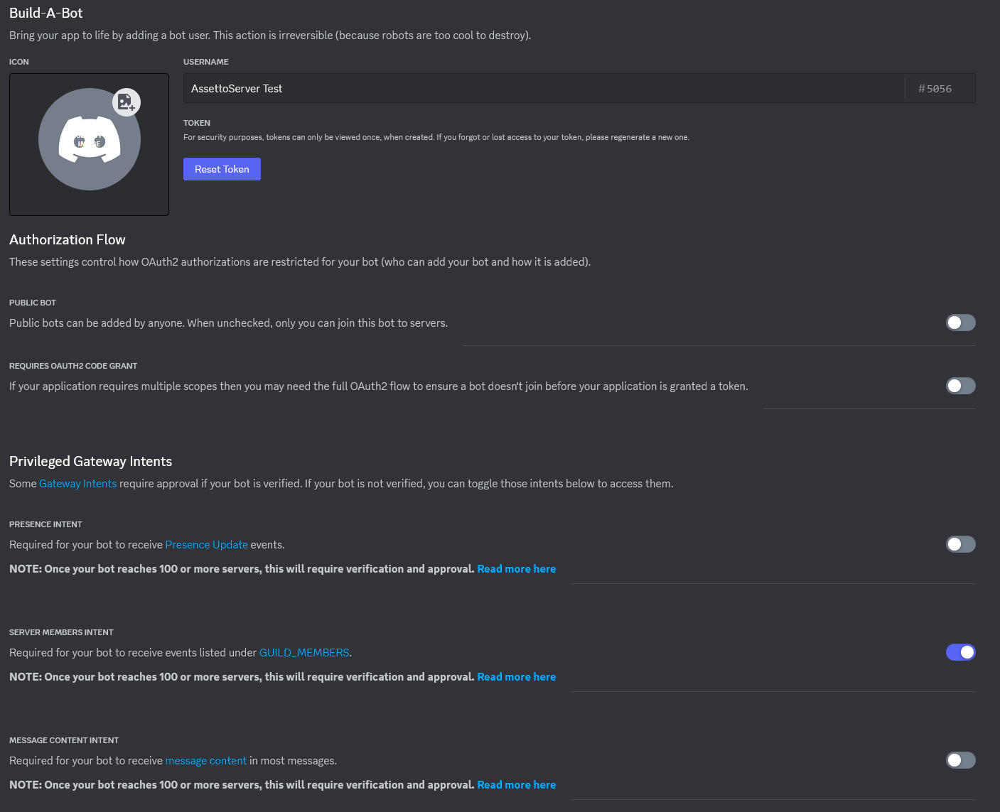

* 在左侧点击 `OAuth2` 并选择 `URL Generator`。
* 在 `Scopes` 下，确保勾选了 `bot`。
* 在 `Bot Permissions` 下，确保勾选了 `Send Messages` 和 `Manage Roles`。

页面应如下所示：

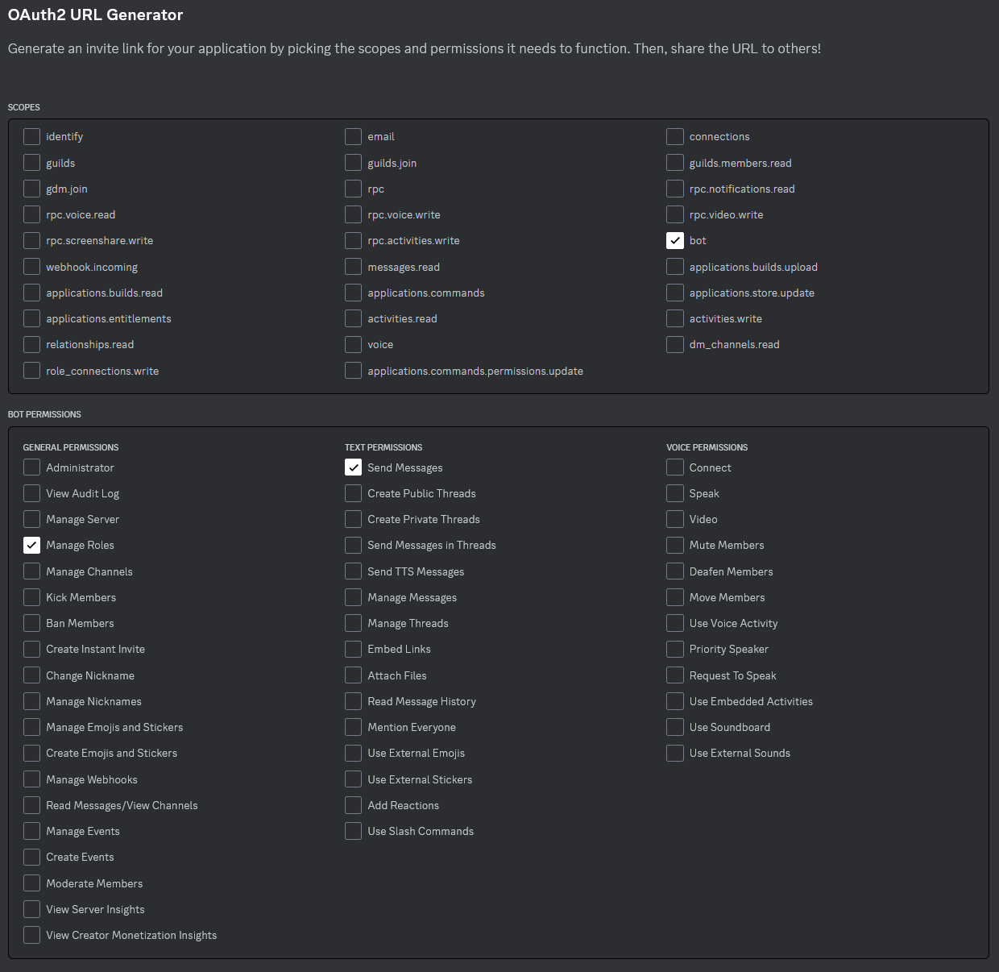

* 复制页面底部生成的 URL，并将其粘贴到浏览器中。
* 为你的 Discord 服务器授权该机器人。
* 返回 Developer Portal 的 `Bot` 页面。
* 复制你的机器人令牌并粘贴到 `configuration.yml` 中，如下所示：`DiscordBotToken: "your token here"`

**搞定！**下次启动 AssettoServer Hub 时，它将会连接到 Discord。

## 关联 Steam 账户
建议为关联 Steam 账户创建一个新的只读频道。  
在该频道中使用 `/steam-link post` 命令。机器人将创建一个用于关联/解除关联 Steam 账户的帖子：

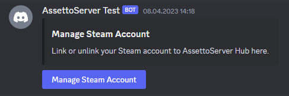

点击按钮后，用户可以输入自己的 Steam 个人资料 URL：

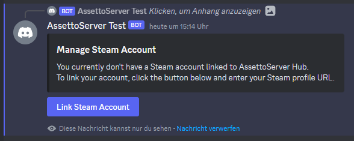

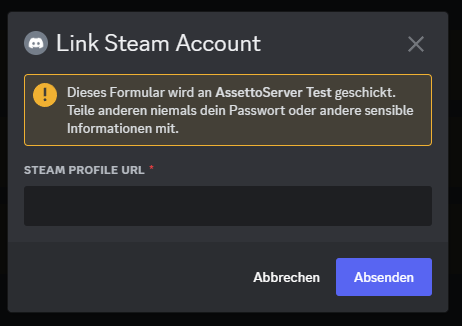

输入 Steam 个人资料 URL 后：

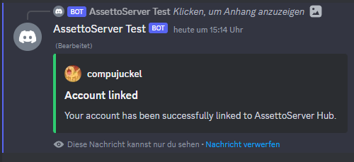

### 管理已关联的账户

管理员可以使用以下命令管理已关联的 Steam 账户：

* `/steam-link find-discord` - 根据 SteamID 查找对应的 Discord 用户
* `/steam-link find-steam` - 根据 Discord 用户查找对应的 SteamID
* `/steam-link unlink` - 解除 SteamID 与 Discord 用户的关联

## 审计日志

AssettoServer Hub 可以将一些事件（关联 Steam 账户、创建/删除用户组等）发布到指定频道。使用 `/audit-log set` 命令可启用此功能。

## Discord 用户组

Discord 身份组可以关联到 AssettoServer 用户组。可用于白名单、预留槽位等。

### 添加用户组

使用 `/user-group add` 命令创建用户组：

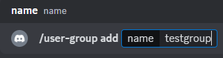

下一步，为该用户组选择 Discord 身份组：

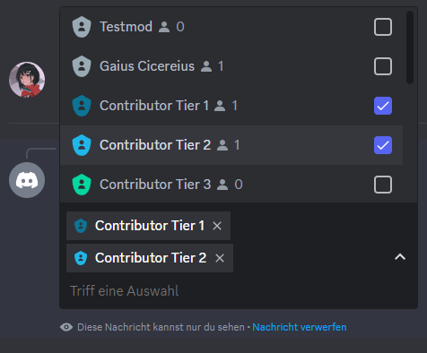

之后，用户组将被创建：

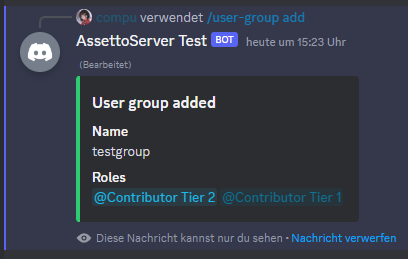

现在，你可以在服务器配置中使用该组了。  
有关用户组的更多一般信息，请参见[此页面](./user-groups.md)。

### 移除用户组

要移除某个组，只需使用 `/user-group remove` 命令。

## 用户组映射

现有的 AssettoServer 用户组可以映射到 Discord 身份组。例如，可以配合 [PatreonTimingPlugin](../plugins/PatreonTimingPlugin.mdx)，根据计时排行榜分配身份组。

### 根据计时排行榜分配身份组

首先，在 `configuration.yml` 中添加一个新的计时用户组：

```yaml title="configuration.yml (AssettoServer Hub)"
TimingUserGroups:
  - Name: timing_top3
    PostFilter: CarRank <= 3
```

这将创建一个名为 `timing_top3` 的用户组，其中包含任意车辆排行榜时间排名前 3 的所有玩家。

接下来，使用 `/user-group map` 命令将该用户组映射到 Discord 身份组。例如 `/user-group map timing_top3 <your role>`：

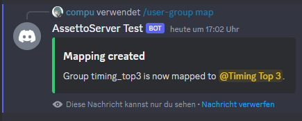

现在，所有已关联 Steam 账户且拥有前 3 排行榜成绩的用户都将获得该身份组。

<details>
<summary>自定义计时筛选器（高级）</summary>
<p>

创建计时身份组的条件可通过 SQL WHERE 子句完全自定义。以下查询用于确定计时用户组：

```sql
WITH ranks AS (SELECT tle.player_id,
                      c.model           AS CarModel,
                      tle.created_at    AS CreatedAt,
                      t.name            AS Track,
                      ts.name           AS Stage,
                      MIN(tle.lap_time) AS LapTime,
                      RANK() OVER (
                          PARTITION BY t.track_id, ts.timing_stage_id, tle.car_id
                          ORDER BY tle.lap_time
                          )             AS CarRank,
                      RANK() OVER (
                          PARTITION BY t.track_id, ts.timing_stage_id
                          ORDER BY tle.lap_time
                          )             AS Rank
               FROM timing_leaderboard_entries tle
               JOIN cars c on c.car_id = tle.car_id
               JOIN timing_leaderboards tl on tl.timing_leaderboard_id = tle.timing_leaderboard_id
               JOIN timing_stages ts on ts.timing_stage_id = tle.timing_stage_id
               JOIN tracks t on ts.track_id = t.track_id
              WHERE tle.valid = true
               --#preFilter
               GROUP BY t.name, ts.name, tle.car_id, tle.player_id
               ORDER BY t.name, ts.name, MIN(tle.lap_time))
SELECT DISTINCT r.player_id 
           FROM ranks r 
          --#postFilter
```

使用的数据库是 [SQLite](https://www.sqlite.org/lang_select.html)。

`PreFilter` 和 `PostFilter` 可用于自定义生成的用户组。例如，以下配置只会为当月设置的圈速创建用户组：

```yaml title="configuration.yml (AssettoServer Hub)"
TimingUserGroups:
  - Name: timing_top5_month
    PreFilter: tle.created_at > date('now', 'start of month')
    PostFilter: CarRank <= 5
```

</p>
</details>

### 根据计时积分排行榜分配身份组

首先，在 `configuration.yml` 中添加一个新的计时积分用户组：

```yaml title="configuration.yml (AssettoServer Hub)"
TimingPointsUserGroups:
  - Name: timing_points_top10
    PostFilter: Rank <= 10
  - Name: timing_points_traffic_1000
    PreFilter: Leaderboard = 'Traffic'
    PostFilter: Points >= 1000
```

这将创建两个用户组：
* `timing_points_top10` 包含所有排行榜中排名前 10 的玩家。
* `timing_points_traffic_1000` 包含 `Traffic` 排行榜上积分超过 1000 的所有玩家。

### 根据竞速挑战排行榜分配身份组

首先，在 `configuration.yml` 中添加一个新的竞速挑战用户组：

```yaml title="configuration.yml (AssettoServer Hub)"
RaceChallengeUserGroups:
  - Name: race_top5
    Leaderboard: Default
    Filter: Rank <= 5
  - Name: race_1200_rating
    Leaderboard: Traffic
    Filter: Rating > 1200
```

这将创建两个用户组：
* `race_top5` 包含 `Default` 排行榜上排名前 5 的玩家。
* `race_1200_rating` 包含 `Traffic` 排行榜上评分高于 1200 的所有玩家。

### 根据超车排行榜分配身份组

你也可以根据超车排行榜分配用户组。两个示例：

```yaml title="configuration.yml (AssettoServer Hub)"
OvertakeUserGroups:
  - Name: overtake_top100
    PostFilter: Rank <= 100
  - Name: overtake_500k
    PostFilter: Score >= 500000
```

这将创建两个用户组：
* `overtake_top100` 包含排名前 100 的玩家
* `overtake_500k` 包含至少 500,000 分的所有玩家

接下来，使用 `/user-group map` 命令将该用户组映射到 Discord 身份组。例如 `/user-group map overtake_top100 <your role>`。  
现在，所有已关联 Steam 账户且拥有前 100 排行榜成绩的用户都将获得该身份组。

<details>
<summary>自定义超车筛选器（高级）</summary>
<p>

筛选方式与上面的计时排行榜筛选类似。你可以使用 `PreFilter` 在生成排名之前筛选成绩，例如只统计当月的成绩。
然后可以使用 `PostFilter` 按分数、排名等进行筛选。  

可用作筛选条件的所有列名：`Name`、`Leaderboard`、`PlayerId`、`CarModel`、`Score`、`Duration`、`CreatedAt`、`DiscordId`、`Rank`

</p>
</details>

### 根据安全评分分配身份组

[PatreonSafetyRatingPlugin](../plugins/PatreonSafetyRatingPlugin.mdx) 可以为每个等级创建一个用户组，例如：

```yaml title="configuration.yml (AssettoServer Hub)"
SafetyRatingRanks:
- Color: '#00FF00'
  MinimumRating: 4
  Name: A
# highlight-next-line
  UserGroupName: safety_a
- Color: null
  MinimumRating: 1
  Name: B
- Color: '#FF0000'
  MinimumRating: 0
  Name: C
```

这将为每个拥有 A 评级的驾驶员创建一个名为 `safety_a` 的用户组。你现在可以使用 `/user-group map safety_a <your role>` 为所有 A 评级驾驶员分配身份组。

### 移除映射

可以使用 `/user-group unmap` 命令移除映射。

## 服务器状态

AssettoServer Hub 可以为你的游戏服务器创建如下所示的服务器状态消息：

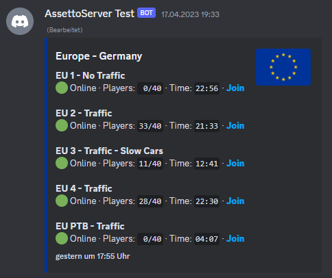

为此，请在 `configuration.yml` 中添加一个新的部分，例如：

```yaml title="configuration.yml (AssettoServer Hub)"
DiscordServerStatus:
  # Name that will be used for creating the embed
  srp-eu:
    # Embed title
    Title: Europe - Germany
    # Embed thumbnail
    ThumbnailUrl: https://flagcdn.com/w160/eu.png
    # Embed template - read below for more info
    Template: default
    # Embed color
    Color: "#003399"
    # List of game servers to query
    Servers:
      # Server name
      - Name: EU 1 - No Traffic
        # Server address in format ip:httpPort
        Address: 65.108.176.35:8081
      - Name: EU 2 - Traffic
        Address: 65.108.176.35:8082
      - Name: EU 3 - Traffic - Slow Cars
        Address: 65.108.176.35:8083
      - Name: EU 4 - Traffic
        Address: 65.108.176.35:8085
      - Name: EU PTB - Traffic
        Address: 65.108.176.35:8084
```

可以在频道中使用 `/server-status <name>` 命令发布服务器状态消息，例如 `/server-status srp-eu`。

<details>
<summary>自定义模板（高级）</summary>
<p>

嵌入消息可以使用 [Scriban 模板](https://github.com/scriban/scriban)进行自定义。

AssettoServer Hub 内置了以下默认模板：

```
{{ for server in servers }}
**{{ server.alias }}**
{{ if server.online -}}
  :green_circle: Online · Players: `{{ server.clients | string.pad_left 2 }}/{{ server.max_clients | string.pad_left 2 }}` · Time: `{{ server.time }}` · **[Join]({{ server.invite }})**
{{- else -}}
  :red_circle: Offline
{{- end }}
{{ end }}
```

你可以通过在 `configuration.yml` 中添加 `DiscordServerStatusTemplates` 部分来添加自定义模板。示例：

```yaml title="configuration.yml (AssettoServer Hub)"
DiscordServerStatusTemplates:
  emoji: |
    {{ for server in servers }}
    **{{ server.alias }}**
    {{
      if server.online
        fill = server.clients / server.max_clients
        if fill < 0.5
          ":green_circle:"
        else if fill < 0.75
          ":yellow_circle:"
        else
          ":orange_circle:"
        end
        " Online"
      else
        ":red_circle: Offline"
      end
      
      timeSplit = server.time | string.split ":"
      hours = timeSplit[0] | string.to_int
      minutes = timeSplit[1] | string.to_int
      
      if minutes >= 45
        hours += 1
      end
      
      hours = hours % 12
      
      if hours == 0
        hours = 12
      end
      
      if minutes > 15 && minutes < 45
        minutes = 30
      else
        minutes = ""
      end
      
      clockEmoji = ":clock" + hours + minutes + ":" 
    }} · :busts_in_silhouette: `{{ server.clients | string.pad_left 2 }}/{{ server.max_clients | string.pad_left 2 }}` · {{ clockEmoji }} `{{ server.time }}` · **[Join]({{ server.invite }})**
    {{ end }}
```

此模板会根据服务器上的玩家数量改变绿点的颜色，并用时钟表情符号显示正确的时间。

然后，你可以在 `DiscordServerStatus` 配置中设置 `Template: emoji` 来使用此模板。

模板的输出效果：

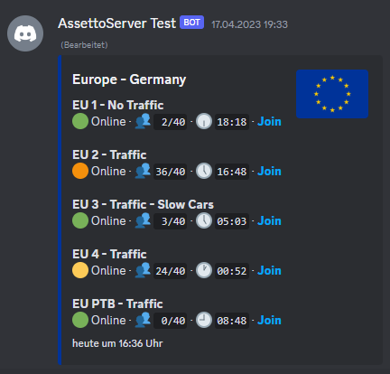

</p>
</details>

## 排行榜

### 计时积分排行榜

使用 `/timing-points-leaderboard` 命令在当前频道创建排行榜。

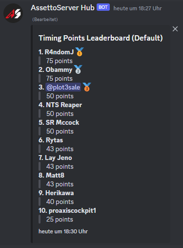

<details>
<summary>自定义模板（高级）</summary>
<p>

嵌入消息可以使用 [Scriban 模板](https://github.com/scriban/scriban)进行自定义。

AssettoServer Hub 内置了以下默认模板：

```
{{ 
func to_emoji(rank)
    case rank
        when 1
            " :first_place:"
        when 2
            " :second_place:"
        when 3
            " :third_place:"
    end
end

func get_mention(entry)
    if entry.discord_id > 0
        " — <@"
        entry.discord_id
        ">"
    end
end

for entry in entries -}}
**{{ for.index + 1 }}\. {{ entry.name }}{{ get_mention entry }}{{ to_emoji for.index + 1 }}**
> {{ entry.points | math.format "#,#" }} points
{{ end }}
```

你可以通过在 `configuration.yml` 中添加以下内容来添加自定义模板：

```yaml title="configuration.yml (AssettoServer Hub)"
DiscordTimingPointsLeaderboardTemplates:
  TestTemplate: |
    text of your template
    can be multiple lines
```

`/timing-points-leaderboard` 命令包含一个名为 `template` 的可选参数。你可以用它来指定自己的自定义模板（上例中的 `TestTemplate`）。

</p>
</details>

### 计时路段排行榜

使用 `/timing-stage-leaderboard` 命令在当前频道创建排行榜。

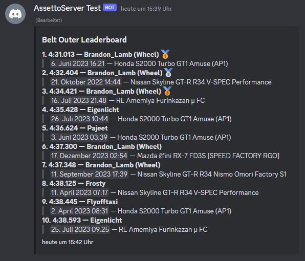

<details>
<summary>自定义模板（高级）</summary>
<p>

嵌入消息可以使用 [Scriban 模板](https://github.com/scriban/scriban)进行自定义。

AssettoServer Hub 内置了以下默认模板：

```
{{ 
func to_emoji(rank)
    case rank
        when 1
            " :first_place:"
        when 2
            " :second_place:"
        when 3
            " :third_place:"
    end
end

func get_mention(entry)
    if entry.discord_id > 0
        " — <@"
        entry.discord_id
        ">"
    end
end

func format_duration(duration)
    d = timespan.from_milliseconds duration
    d.minutes | math.format '0'
    ":"
    d.seconds | math.format '00'
    "."
    d.milliseconds | math.format '000'
end

for entry in entries -}}
**{{ for.index + 1 }}\. {{ format_duration entry.lap_time }} — {{ entry.name }}{{ get_mention entry }} {{ to_emoji for.index + 1 }}**
> <t:{{ entry.created_at | date.to_string '%s' }}> — {{ entry.car_display_name }}
{{ end }}
```

你可以通过在 `configuration.yml` 中添加以下内容来添加自定义模板：

```yaml title="configuration.yml (AssettoServer Hub)"
DiscordTimingStageLeaderboardTemplates:
  TestTemplate: |
    text of your template
    can be multiple lines
```

`/timing-stage-leaderboard` 命令包含一个名为 `template` 的可选参数。你可以用它来指定自己的自定义模板（上例中的 `TestTemplate`）。

</p>
</details>

### 竞速挑战排行榜

使用 `/race-challenge-leaderboard` 命令在当前频道创建排行榜。

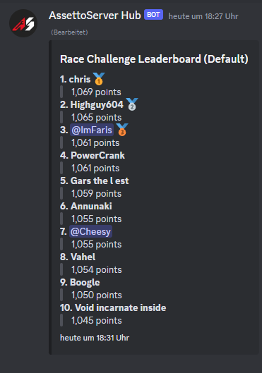

<details>
<summary>自定义模板（高级）</summary>
<p>

嵌入消息可以使用 [Scriban 模板](https://github.com/scriban/scriban)进行自定义。

AssettoServer Hub 内置了以下默认模板：

```
{{ 
func to_emoji(rank)
    case rank
        when 1
            " :first_place:"
        when 2
            " :second_place:"
        when 3
            " :third_place:"
    end
end

func get_mention(entry)
    if entry.discord_id > 0
        " — <@"
        entry.discord_id
        ">"
    end
end

for entry in entries -}}
**{{ for.index + 1 }}\. {{ entry.name }}{{ get_mention entry }}{{ to_emoji for.index + 1 }}**
> {{ entry.rating | math.format "#,#" }} points
{{ end }}
```

你可以通过在 `configuration.yml` 中添加以下内容来添加自定义模板：

```yaml title="configuration.yml (AssettoServer Hub)"
DiscordRaceChallengeLeaderboardTemplates:
  TestTemplate: |
    text of your template
    can be multiple lines
```

`/race-challenge-leaderboard` 命令包含一个名为 `template` 的可选参数。你可以用它来指定自己的自定义模板（上例中的 `TestTemplate`）。

</p>
</details>

### 超车排行榜

使用 `/overtake-leaderboard` 命令在当前频道创建排行榜。

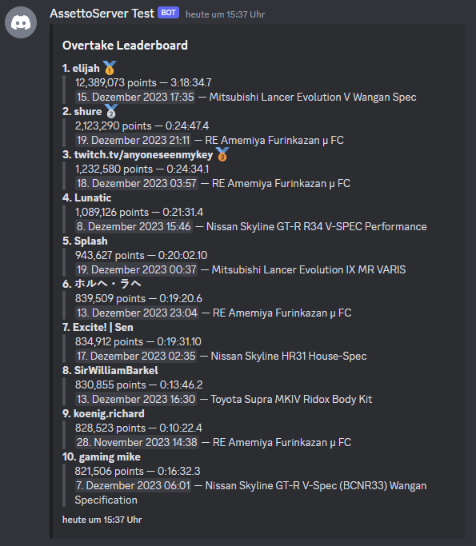

<details>
<summary>自定义模板（高级）</summary>
<p>

嵌入消息可以使用 [Scriban 模板](https://github.com/scriban/scriban)进行自定义。

AssettoServer Hub 内置了以下默认模板：

```
{{ 
func to_emoji(rank)
    case rank
        when 1
            " :first_place:"
        when 2
            " :second_place:"
        when 3
            " :third_place:"
    end
end

func get_mention(entry)
    if entry.discord_id > 0
        " — <@"
        entry.discord_id
        ">"
    end
end

func format_duration(duration)
    d = timespan.from_milliseconds duration
    d.hours | math.format '0'
    ":"
    d.minutes | math.format '00'
    ":"
    d.seconds | math.format '00'
    "."
    d.milliseconds / 100 | math.round
end

for entry in entries -}}
**{{ for.index + 1 }}\. {{ entry.name }}{{ get_mention entry }}{{ to_emoji for.index + 1 }}**
> {{ entry.score | math.format "#,#" }} points — {{ format_duration entry.duration }}
> <t:{{ entry.created_at | date.to_string '%s' }}> — {{ entry.car_display_name }}
{{ end }}
```

你可以通过在 `configuration.yml` 中添加以下内容来添加自定义模板：

```yaml title="configuration.yml (AssettoServer Hub)"
DiscordOvertakeLeaderboardTemplates:
  TestTemplate: |
    text of your template
    can be multiple lines
```

`/overtake-leaderboard` 命令包含一个名为 `template` 的可选参数。你可以用它来指定自己的自定义模板（上例中的 `TestTemplate`）。

</p>
</details>

## RCON（远程控制台）

你可以使用 `/rcon` 命令在已连接的服务器上执行命令。

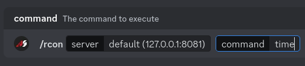

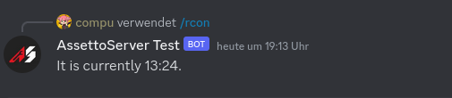