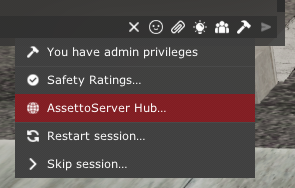
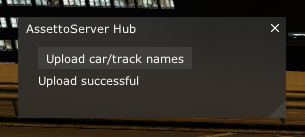

# AssettoServer Hub

## 简介
AssettoServerHub 是多个 AssettoServer 实例的中央数据存储。它允许服务器之间共享排行榜、
黑名单、白名单等内容，未来还将支持更多。

## 快速开始
首次启动 `AssettoServer.Hub` 时，会生成一个名为 `configuration.yml` 的默认配置文件。  
使用服务器地址和生成的密钥，通过加载并配置 [PatreonHubPlugin](../plugins/PatreonHubPlugin.mdx) 来连接 AssettoServer 实例。

## 网页界面
网页界面可以通过你在配置中指定的 `HttpPort` 访问，例如 `http://yourip:8000`。你也可以在[这里](https://demo.assettoserver.org)查看演示。

## 如何添加更多服务器
你可以像下面这样添加更多的 `Name` 条目，来接入更多服务器：
```yaml
# Port that the hub will listen for server (gRPC) connections
GrpcPort: 5085
# Port that the hub will listen on for the web interface
HttpPort: 8000
# Name of the hub, will be shown in web page titles
HubName: AssettoServer Hub
# Filename of main logo in wwwroot/images
MainLogoFile: logo.svg
# Filename of logo shown in nav bar in wwwroot/images
NavbarLogoFile: logo.svg
# List of keys that are allowed to connect to the hub. Do not share these keys with other people!
Keys:
- Name: server-1
- Name: another-server
- Name: server-3
# List of file-based user groups
FileBasedUserGroups:
  - Name: blacklist
    Path: blacklist.txt
  - Name: whitelist
    Path: whitelist.txt
```

启动 Hub 后，系统会为每个尚未拥有密钥的条目自动生成密钥。然后，你可以将生成的密钥
填入你的 AssettoServer 配置中。

## 如何在排行榜中使用友好的车辆/赛道名称 {#friendly-names}

在加载了 [PatreonHubPlugin](../plugins/PatreonHubPlugin.mdx) 的游戏服务器上，以管理员身份登录，然后通过聊天中的锤子图标选择 `AssettoServer Hub`：



点击 `Upload car/track names`。



之后，排行榜将使用正确的名称（例如 `Nissan Skyline GT-R R34 V-SPEC Performance`，而不是 `nissan_skyline_r34_v-specperformance`）

## 工作原理
AssettoServerHub 和 AssettoServer 之间使用 gRPC 通信。数据存储在名为 `Hub.db` 的 SQLite 数据库中。
