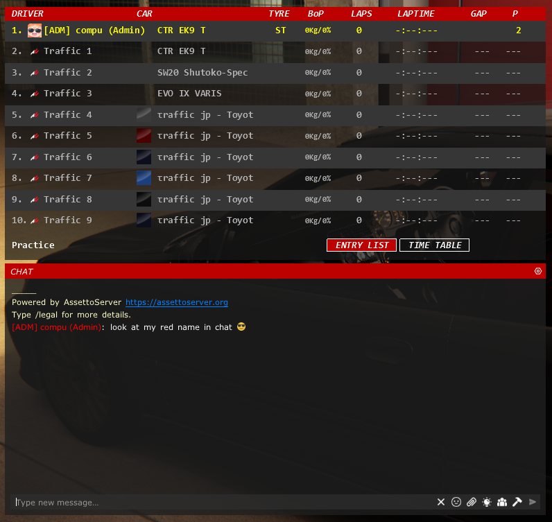

import CodeBlock from '@theme/CodeBlock';
import cfg from "!!raw-loader!./reference/plugin_patreon_chat_roles_cfg.reference.yml";

# PatreonChatRolesPlugin

::::tip

如果你的社区使用 Discord 服务器，请改用 [PatreonSocialPlugin](./PatreonSocialPlugin.md)！

::::

::::note

需要强制最低 CSP 版本 0.1.77 (1937)，并且在 `extra_cfg.yml` 中设置 `EnableClientMessages: true`！

* 聊天颜色需要 CSP 0.1.79 或更高版本
* 自定义图标需要 CSP 0.1.80-preview218 或更高版本

::::

用于更改玩家聊天颜色、添加玩家图标的插件，还可以为玩家添加名称前缀或后缀。  
建议名称前缀/后缀使用方括号，因为玩家正常情况下无法使用带方括号的名称加入服务器。

有关用户组的一般信息，请参见[此页面](../assettoserver-hub/user-groups.md)。

自定义图标和聊天红名的示例：



在 Content Manager 中启用 `New driver tags` 后，颜色和自定义图标也会显示在名牌中。

## 配置
在 `extra_cfg.yml` 中启用该插件
```yaml title="extra_cfg.yml"
EnablePlugins:
  - PatreonChatRolesPlugin
```

### 参考配置
<CodeBlock language="yaml" title="plugin_patreon_chat_roles_cfg.yml">{cfg}</CodeBlock>
