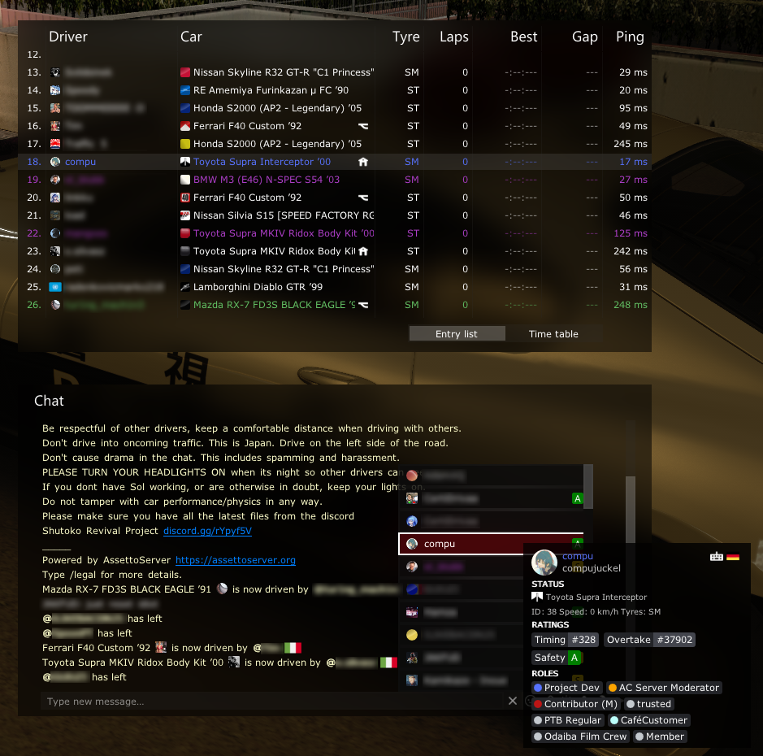
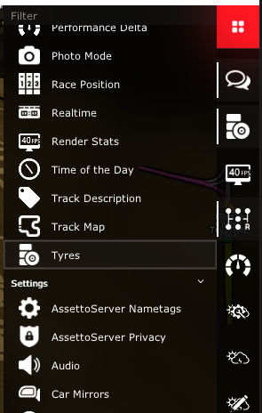
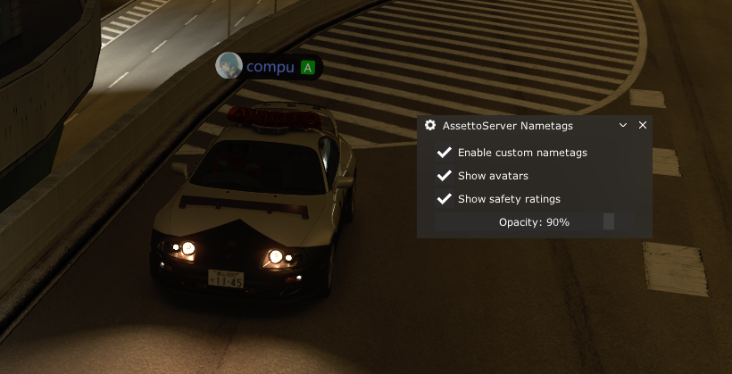

# PatreonSocialPlugin

该插件为你的游戏服务器提供 Discord 和 Steam 用户资料、Discord 身份组集成以及头像显示。  
它还会显示排行榜名次和安全评分（如果启用了相应插件），以及当前使用的输入方式。

::::note

该插件需要 PatreonHubPlugin 才能工作。

玩家需要至少 CSP 0.2.7 才能加载该插件。

::::



## 游戏内设置

可以在右侧边栏中找到该插件的设置。



### AssettoServer 名牌

玩家可以通过一个小型游戏内菜单，按自己的喜好自定义名牌。这些设置将应用于所有运行 PatreonSocialPlugin 的服务器。



### AssettoServer 隐私

玩家可以选择隐藏其 Discord 和/或 Steam 个人资料信息。这些设置将应用于连接到同一 AssettoServer Hub 实例的所有服务器。

## 配置
在 `extra_cfg.yml` 中启用该插件
```yaml title="extra_cfg.yml"
EnablePlugins:
  - PatreonHubPlugin
  - PatreonSocialPlugin
```

无需进一步配置。
