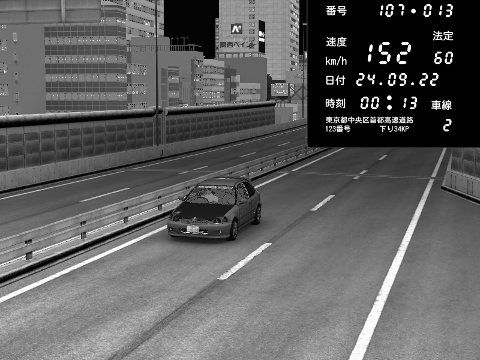

import CodeBlock from '@theme/CodeBlock';
import cfg from "!!raw-loader!./reference/plugin_patreon_speed_trap_cfg.reference.yml";

# PatreonSpeedTrapPlugin
启用 Shutoko Revival Project 上的测速点。  
如果玩家以超过 100km/h 的速度驶过测速点，会看到一道红色闪光，并且证据照片还可以选择发送到 Discord 频道。

::::note

需要强制最低 CSP 版本 0.1.77 (1937)，并且在 `extra_cfg.yml` 中设置 `EnableClientMessages: true`！

::::

::::caution

启用证据照片后，图片上传可能导致客户端卡顿！  
此外，图像处理对服务器 CPU 的负担较大。如果你的服务器运行在性能很弱的机器上，请不要使用此功能。

::::



[测速点位置地图](./assets/speedtrap-map.jpg)（感谢 CaptFingerpaint！）

## 配置
在 `extra_cfg.yml` 中启用该插件
```yaml title="extra_cfg.yml"
EnablePlugins:
  - PatreonSpeedTrapPlugin
```

### 参考配置
<CodeBlock language="yaml" title="plugin_patreon_speed_trap_cfg.yml">{cfg}</CodeBlock>

### 自定义图像覆盖层

图像可以通过 Lua 完全自定义。默认覆盖层的源代码位于插件文件夹的 `lua/script.lua` 中。
该插件使用 ImageMagick（更确切地说是 [Magick.NET](https://github.com/dlemstra/Magick.NET)）来处理图像。

### 自定义测速点 {#custom-speed-traps}

如果你想在 SRP 以外的地图上使用该插件，可以定义自定义测速点位置。  
`Position` 和 `Forward` 的取值方法与 [PatreonTimingPlugin](./PatreonTimingPlugin.mdx) 相同。
摄像头位置可以使用游戏内的测速点调试应用找到。设置 `Debug: true` 即可启用该应用。
可以通过聊天应用中的灯泡图标打开。

以下是在 Imola 第一弯 300m 标牌处设置测速点的示例：
```yaml
CustomSpeedTraps:
  # ID of speed trap
  - Id: 1
    # Position of detection line
    Position: { X: -192.78, Y: -82.89, Z: -426.28 }
    # Forward vector of detection line
    Forward: { X: -195.07, Y: -82.9, Z: -425.97 }
    # Radius around detection point
    RadiusMeters: 10
    # Camera position
    CameraPosition: { X: -202.15, Y: -76.31, Z: -424.98 }
    # Direction of camera
    CameraLook: { X: 0.81, Y: -0.58, Z: -0.05 }
    # Camera FOV
    CameraFov: 60
    # Allowed speed, speed trap will not trigger when speed is below this value
    AllowedSpeedKph: 20
    # Enable red flash
    EnableFlash: true
    # Name of mesh that is turned into a red emissive (optional, when in doubt leave empty)
    MeshName:
```

## 已知问题

如果服务器路径中包含非 ASCII 字符（如西里尔字母等），该插件将无法工作。
