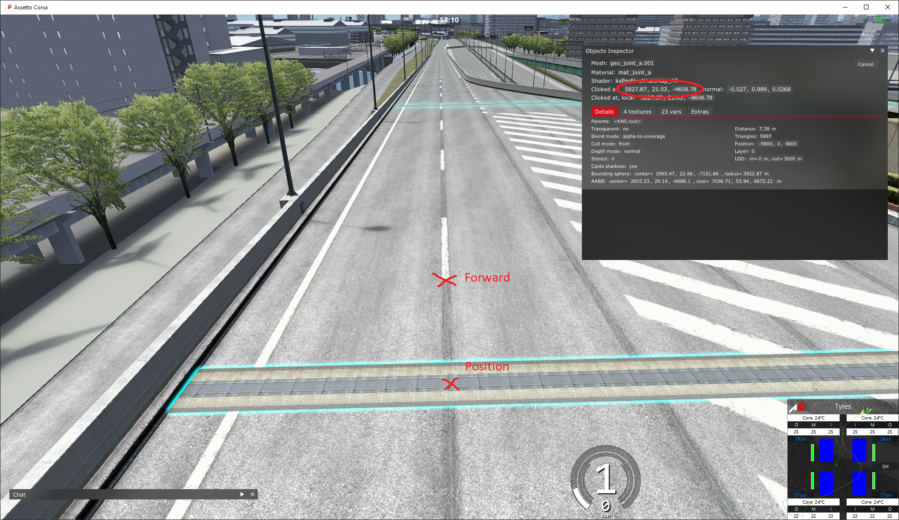
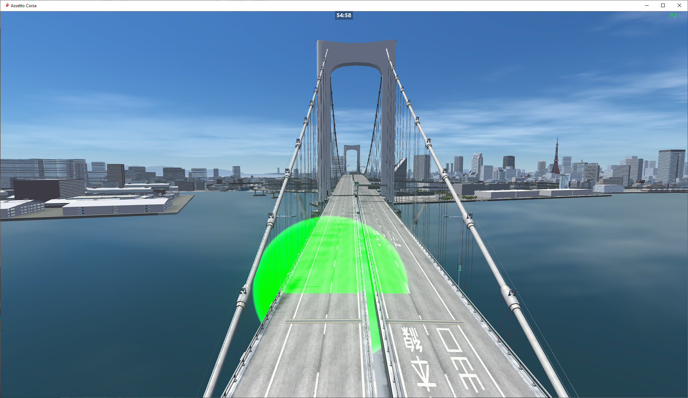

import CodeBlock from '@theme/CodeBlock';
import cfg from "!!raw-loader!./reference/plugin_patreon_timing_cfg.reference.yml";

# PatreonTimingPlugin
该插件允许你为每条赛道定义多个计时路段。对于 SRP 这类客户端不加载 AI 行驶线路的大型地图非常有用。  
附带基于 AssettoServerHub 的排行榜。

::::note

需要强制最低 CSP 版本 0.1.77 (1937)，并且在 `extra_cfg.yml` 中设置 `EnableClientMessages: true`！

::::

## 如何创建检查点
每个检查点需要两个坐标："Position" 和 "Forward"。可以使用 Object Inspector 应用按如下方式查找坐标：  
  
检查点将放置在 "Position" 上，并朝向 "Forward" 所指的方向。  

::::caution 检查点的方向非常重要！

从相反方向驶过检查点时不会触发。

::::

创建检查点后，你可以在计时排行榜上勾选 "Debug checkpoints" 复选框，在游戏内查看它们：

绿色 = 计时区域的起点  
蓝色 = 检查点  
红色 = 检查点的背面。从该方向驶来时，检查点不会触发  

## 配置
在 `extra_cfg.yml` 中启用该插件
```yaml title="extra_cfg.yml"
EnablePlugins:
  - PatreonTimingPlugin
```

### SRP 示例配置
<CodeBlock language="yaml" title="plugin_patreon_timing_cfg.yml">{cfg}</CodeBlock>
