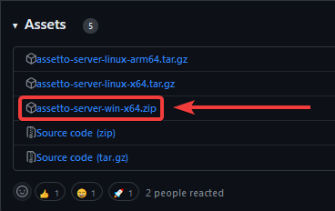
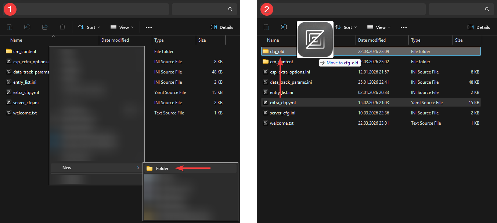
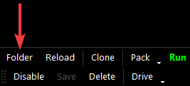

import Tabs from '@theme/Tabs';
import TabItem from '@theme/TabItem';

## 简介 {#intro}

本页面将引导你在 Windows 机器上把 AssettoServer 从 0.0.54 更新到 0.0.55。如果你还没有配置好服务器，或者想从头开始，请改为阅读并遵循[新手指南](./thebeginnersguide.md)。

## 前提条件 {#prerequisites}

要跟随本指南，你需要准备以下内容：

- 一台已在使用 AssettoServer 0.0.54 的服务器。
- AssettoServer 0.0.55 的**最新**版本。
- 已阅读 [Changelog](https://github.com/compujuckel/AssettoServer/releases/tag/v0.0.55) 中的变更内容。
- 对文本编辑器的基本使用有了解。

### 下载最新版本的 AssettoServer 0.0.55 {#latest-version}

1. 前往 [AssettoServer 的最新 GitHub 发布页](https://github.com/compujuckel/AssettoServer/releases/latest)。

2. 在发布页的 Assets 区域点击 `assetto-server-win-x64.zip` 下载该文件。

   

## 备份与更新 {#backup-updating}

新版本对 `extra_cfg.yml` 以及插件的配置方式做了重大变更，这意味着你不能原封不动地复用现有的 `extra_cfg.yml`。

:::caution

以下步骤在"专用文件夹"与"在 Content Manager 内"两种托管方式下略有差异，点击下方对应的标签页即可。

:::

<Tabs groupId="install-method" >
  <TabItem value="folder" label="专用文件夹">

1. 导航到你当前服务器的 `cfg` 文件夹，新建一个名为 `cfg_old` 的文件夹。

2. 把现有的 `extra_cfg.yml` 移动到 `cfg_old` 文件夹。
   

3. 现在，回到服务器主目录，把我们之前下载的 AssettoServer 0.0.55 发布包 `assetto-server-win-x64.zip` 解压进去，如提示覆盖文件请确认。

4. 运行一次新的 `AssettoServer.exe`，生成一份全新的、更新后的 `extra_cfg.yml`。

5. 回到 `cfg` 文件夹，打开新的 `extra_cfg.yml`，并参照 `cfg_old` 文件夹中旧的 `extra_cfg.yml`，启用你之前启用过的插件。  
   **不要把旧 `extra_cfg.yml` 底部的旧插件配置复制过来！**

6. 再次运行 `AssettoServer.exe`，生成新的插件配置文件。它们会生成在 `cfg` 文件夹中 `extra_cfg.yml` 的旁边。

7. 现在你可以参照旧的 `extra_cfg.yml`，编辑 `extra_cfg.yml` 和 `plugin_name_cfg.yml` 文件来恢复原来的设置。

</TabItem>
<TabItem value="cm" label="在 Content Manager 内">

1. 点击预设底部的文件夹按钮，打开预设文件夹。  
   

2. 新建一个名为 `cfg_old` 的文件夹。

3. 把现有的 `extra_cfg.yml` 移动到 `cfg_old` 文件夹。
   

4. 现在，导航到 Assetto Corsa 安装目录下的 `\server` 文件夹。  
   默认情况下，该文件夹位于 `C:\Steam\steamapps\common\assettocorsa\server`。

5. 把 `assetto-server-win-x64.zip` 解压到 `C:\Steam\steamapps\common\assettocorsa\server` 文件夹，使 `AssettoServer.exe` 与 `acServer.exe` 位于同一文件夹。

6. 如果你已经有一个带 AssettoServer 图标的 `acServer.exe`，直接删除它即可。否则，把 `acServer.exe` 重命名为其他名称。（例如 `acServer_default.exe`）

7. 把新的 `AssettoServer.exe` 重命名为 `acServer.exe`

8. 在 Content Manager 中，点击预设的 `Run` 按钮以生成更新后的 `extra_cfg.yml`

9. 回到预设文件夹，打开新的 `extra_cfg.yml`，并参照 `cfg_old` 文件夹中旧的 `extra_cfg.yml`，启用你之前启用过的插件。  
   **不要把旧 `extra_cfg.yml` 底部的旧插件配置复制过来！**

10. 再次运行该预设，生成新的插件配置文件。它们会生成在预设文件夹中 `extra_cfg.yml` 的旁边。

11. 现在你可以参照旧的 `extra_cfg.yml`，编辑 `extra_cfg.yml` 和 `plugin_name_cfg.yml` 文件来恢复原来的设置。

</TabItem>
</Tabs>

:::danger
如果某些参数已不存在于新的 `extra_cfg.yml` 中，请不要复制或恢复它们；这些参数要么已被移到别处（如某个插件配置文件），要么已被彻底移除。  
请参阅 [changelog](https://github.com/compujuckel/AssettoServer/releases/tag/v0.0.55) 以及每个参数上方的注释。
:::
