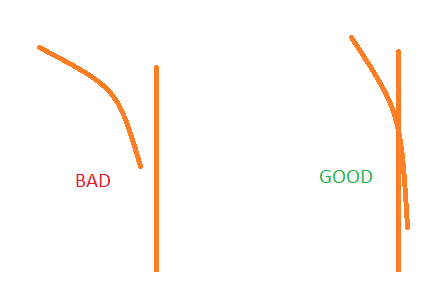
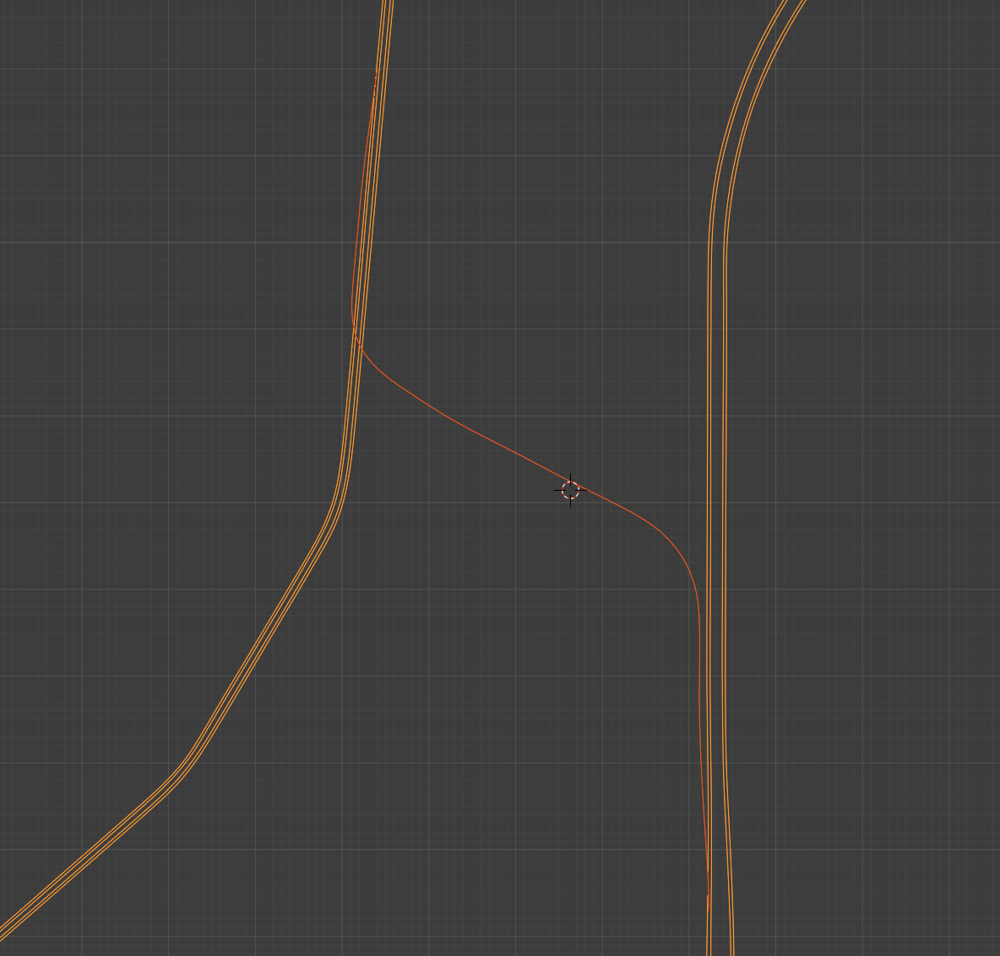
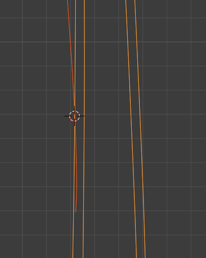
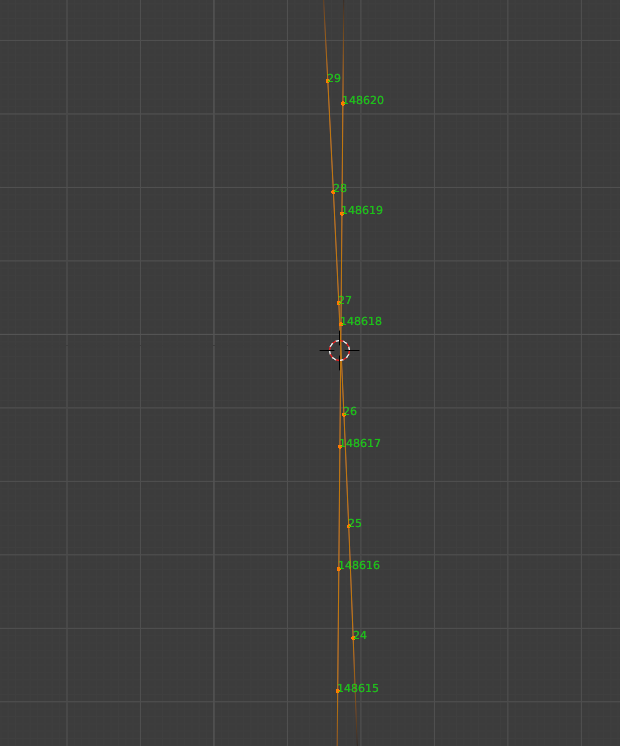
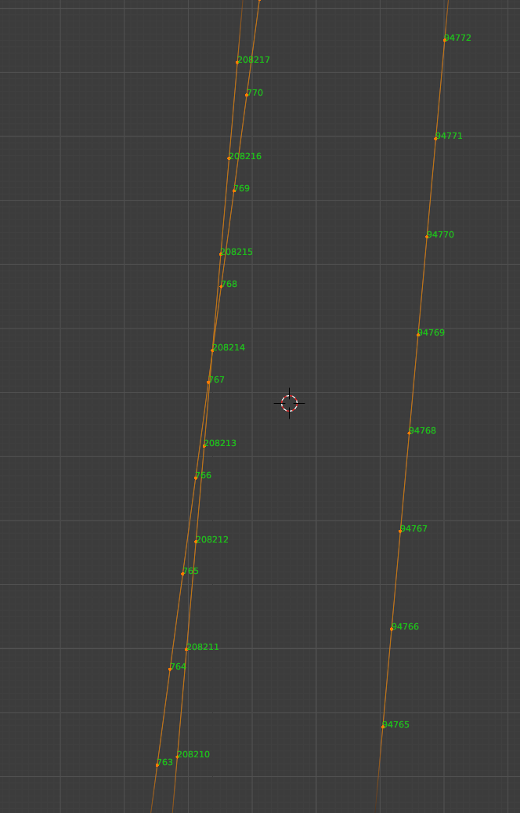

## 前置条件
- 安装了 [io_import_accsv 插件](https://github.com/leBluem/io_import_accsv)的 Blender
- CSP 0.1.77 或更高版本（仅录制行驶线路时需要）
- 从 #ai-spline-discussion 频道置顶消息中获取的新版 AI 行驶线路录制器
- AssettoServer 0.0.47-pre11 或更高版本
- FastLaneUtils（包含在 AssettoServer 下载包中）

::::note

刚接触 Blender？srinoob#8671 编写的[这份指南](https://docs.google.com/presentation/d/1Qh0qBiuyNIxGNFkCEvPtKm4lhmXrD9HtXm1CPiH-UVA/edit?usp=sharing)会对你有帮助！

::::

## 录制行驶线路
- 点对点行驶线路应使用新版 AI 行驶线路录制器应用录制。
- 录制路口点 / AI 行驶线路之间的连接时，尽量保持平滑。突然的方向变化观感会很差。
- 确保各条 AI 行驶线路相互交叉。
- 尽量减少行驶线路之间的重叠。不要重复录制同一车道。AI 车辆之间的障碍物检测在不同行驶线路之间不起作用，因此当一条车道存在多条行驶线路时，AI 车辆可能会互相穿过。



## 处理行驶线路
假设你已经有一条名为 `fast_lane.ai` 的主行驶线路，想为它添加一条支路。

在 Blender 中导入你的行驶线路：`File > Import > AC fast_lane.ai (.ai)`。  
导入点对点行驶线路时，记得勾选 `dont connect first/last verts`。

导入后应该如下图所示（新行驶线路为橙色）：



找到你想放置起始路口的位置。



进入编辑模式（Edit mode），在 `Overlays > Developer > Indices` 下启用索引显示



这里 `148618 -> 28` 是一个不错的路口。`148618` 稍后将用作你这个路口的起始点。  
现在找到终点路口的位置，也就是支路汇入主路的地方。



这里 `766 -> 208214` 看起来很平滑。现在我们用起点和终点，通过 `FastLaneUtils` 来切割行驶线路：

```
.\FastLaneUtils -i fast_lane.ai.candidate -o fast_lane_side.ai --start 28 --end 766 --optimize
```
（如果你不知道怎么用：进入 FastLaneUtils.exe 所在的文件夹，按 Shift+右键并选择"在此处打开 PowerShell 窗口"。然后输入上面的命令，并相应地修改参数。）

优化是可选的，但它能大幅减小行驶线路文件的体积。  
**请记住：优化后的行驶线路只能被 AssettoServer 使用。建议不要删除你的原始行驶线路，以备日后需要。**

现在把你所有的 AI 行驶线路放到地图的 `ai` 文件夹中。

## 创建路口

在 `ai` 文件夹中新建一个名为 `config.yml` 的文件。在我们的示例中，它如下所示：

```yaml
# Restrict AI spline to a certain track so it cannot be loaded on other tracks
Track: shuto_revival_project_beta
# Free field, enter whatever you want
Author: Example
# Version of the spline, useful if you are going to publish updates to your spline. Increment it if you made any changes
Version: 1
Splines:
# Filename of the AI spline
- Name: fast_lane.ai
  # List of junctions for this spline
  Junctions:
  # Name of the junction, enter whatever you want
  - Name: Main -> Side road
    # ID of starting point
    Start: 148618
    # End point of junction. Format: <filename>@<id of point>
    End: fast_lane_side.ai@0
    # Probability of an AI car taking the junction. 0.2 = 20%
    Probability: 0.2
    # Indicate when the junction is taken. Possible values None/Left/Right (optional)
    IndicateWhenTaken: Right
    # Indicate when the junction is NOT taken. Possible values None/Left/Right (optional)
    IndicateWhenNotTaken: Left
    # Start indicating x meters before the junction point. (optional, 75m default)
    IndicateDistancePre: 75
    # Stop indicating x meters after the junction point. (optional, 50m default)
    IndicateDistancePost: 50
- Name: fast_lane_side.ai
  # Connect the last point of this spline to another spline. Use this instead of a junction to connect spline ends
  ConnectEnd: fast_lane.ai@208214
  # Indicate at the spline end. Possible values None/Left/Right (optional)
  IndicateEnd: Right
  # Start indicating x meters before the spline end (optional, 150m default)
  IndicateEndDistancePre: 150
  # End indicating x meters after spline end (optional, 10m default)
  IndicateEndDistancePost: 10
```

请注意，路口终点我们用的是 `fast_lane_side.ai@0` 而不是 `fast_lane_side.ai@28`，因为我们用 `FastLaneUtils` 切割过行驶线路。

现在你可以试一试了！

## 分发行驶线路

处理大量行驶线路可能很麻烦，尤其是当你打算把它们分发给其他人时。  
为此，你可以创建 AI 包（AI package）。只需创建一个包含你所有行驶线路和 `config.yml` 的 zip 文件，然后把文件名改为 `fast_lane.aip` 即可。

::::caution

务必把文件扩展名改成 `.aip` 而不是 `.zip`！  
当服务器在你的 `ai` 文件夹中发现 `.aip` 文件时，它会忽略该文件夹中的所有其他行驶线路，只加载这个 `.aip` 文件。

::::
