import Tabs from '@theme/Tabs';
import TabItem from '@theme/TabItem';

## 如何让车流更密集？ {#dense-traffic}

- 在 `entry_list.ini` 中添加更多用作车流的车辆。这是最重要的一项。例如，只靠 10 辆车流车辆几乎不可能实现高车流密度。
- 调低 `MinAiSafetyDistanceMeters` / `MaxAiSafetyDistanceMeters`，缩小 AI 车辆之间的间距。  
  **不要设得低于约 12 米，否则 AI 车辆可能会在刚生成后立即刹车！**
- 调低 `MinSpawnDistancePoints` / `MaxSpawnDistancePoints`，让车辆在更靠近玩家的位置生成，并填补车流空隙。

## 为什么我在服务器上开不了某些车辆？ {#locked-cars}

某些车辆模组被设计为只能在获得模组作者白名单授权的服务器上驾驶。  
受影响的车辆在其他服务器上使用时，通常不会响应油门输入。  
这一限制内置于车辆模组本身，无法以任何方式解除。  
请注意，这些限制并不是 AssettoServer 的功能。

## 为什么我的出生位置和预期不符？ {#spawn-locations}

你会出生在哪里，取决于你所选赛道及布局中每个索引对应的维修区位置。  
例如，Shutoko Revival Project 的 Main Layout 将 170 个维修区合并到了单一布局中。  
因此，根据每辆车在 `entry_list.ini` 中的索引不同，出生位置也可能不同。  
下面是 Shutoko Revival Project - Main Layout 中索引与出生位置的简表。

| 车辆索引                     | 出生位置                     |
| -------------------------- | ------------------------- |
| `[CAR_0]`   to `[CAR_39]`  | Tatsumi PA                |
| `[CAR_40]`  to `[CAR_61]`  | Yoyogi PA                 |
| `[CAR_62]`  to `[CAR_81]`  | Heiwajima PA - Northbound |
| `[CAR_82]`  to `[CAR_157]` | Heiwajima PA - Southbound |
| `[CAR_158]` to `[CAR_169]` | Daishi PA                 |

:::caution

`entry_list.ini` 中不能跳过索引，也不能出现重复索引。  
也就是说，你不能让车辆列表以 `[CAR_82]` 开头来让所有车都出生在 Heiwajima，也不能写多个 `[CAR_0]` 条目让超过 40 辆车出生在 Tatsumi。  

:::

## 为什么加载时卡在 "Initialising AI spline"？ {#initialising-aispline}

你的游戏正在加载本地游戏文件中的单人模式 AI 行驶线路，而自由漫游服务器并不需要它。  

如果你的服务器使用的是单人模式的交通布局（例如 `Shutoko Revival Project - Shibaura PA Traffic`），请改用该布局的常规版本。 

否则，请把本地游戏文件中赛道布局文件夹里的 `ai` 文件夹重命名为 `ai_off`。    
默认路径：`C:\Program Files (x86)\Steam\steamapps\common\assettocorsa\content\tracks\<trackname>\<layoutname>\ai`  
如果赛道没有多种布局（layout），该文件夹则直接位于赛道文件夹中。

:::note

重命名 `ai` 文件夹后，该布局在单人模式下将无法使用 AI。  
这也会禁用一些客户端处罚系统，例如切角检测（track cuts）。  
如果你以后想在单人模式中重新使用 AI 或这些处罚，只需把 `ai_off` 文件夹改回 `ai` 即可。

:::

## 如何移除校验和？ {#remove-checksums}

:::caution

只有在你能接受用户作弊的情况下才移除校验和。  
校验和用于防止玩家通过修改车辆和赛道数据作弊。  
移除的风险由你自行承担。

:::

<Tabs>
<TabItem value="cars" label="车辆校验和" default>

  - 导航到服务器上的 `\content\cars` 文件夹。
  - 删除每一辆你希望不做校验的车辆文件夹中的 `data.acd`。
  - 在 `extra_cfg.yml` 中设置 `MissingCarChecksums: true`，然后重启服务器。
  - 如果一切操作正确，对于已删除 `data.acd` 的车辆，你将不再看到 `Added checksum for car_name` 日志消息。如果删除了所有车辆的校验和，日志还会显示 `Initialized 0 car checksums`。

</TabItem>
<TabItem value="tracks" label="赛道校验和">

  - 导航到服务器上的 `\content\tracks\<track>\<layout>\data` 和 `\system` 文件夹。
  - 删除两处的 `surfaces.ini` 文件，然后重启服务器。
  - 如果一切操作正确，你会看到日志消息显示 `Initialized 0 track checksums`

</TabItem>
</Tabs>

如果你还添加过其他校验和（例如赛道 kn5 文件或车辆碰撞体），请把那些文件也一并删除。

## 如何添加缺失的赛道参数？ {#adding-trackparams}

你可以选择在本地添加参数，或者在 `extra_cfg.yml` 中将 `MissingTrackParams` 设为 `true` 来忽略此错误。  
请记住，将 `MissingTrackParams` 设为 `true` 可能导致玩家与服务器之间的时间不同步。  

<Tabs>
<TabItem value="new" label="新建" default>

导航到服务器的 `cfg` 文件夹，打开 `data_track_params.ini`。  
转到文件底部，用你的赛道文件夹名作为节标题，为你的赛道添加一个节，如下所示：

```ini title="data_track_params.ini"
[shuto_revival_project_beta_ptb]
NAME=SRP PTB
LATITUDE=
LONGITUDE=
TIMEZONE=
```

打开 [Google 地图](https://www.google.com/maps/)，找到赛道所在的位置。  
在地图上点击右键，点击作为第一个选项显示的经度和纬度数值即可复制。  

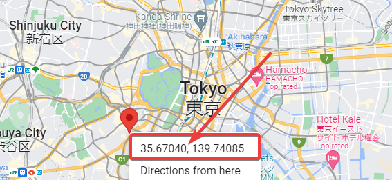  

将它们粘贴到 `LATITUDE=` 和 `LONGITUDE=` 键的后面。

打开 [TZ 时区列表](https://en.wikipedia.org/wiki/List_of_tz_database_time_zones)，找到赛道所在的时区，然后复制 `TZ Identifier`。

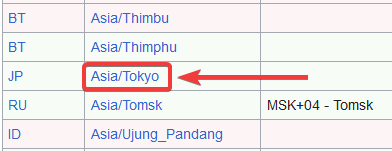  

将它粘贴到 `TIMEZONE=` 键的后面。

现在你应该得到了类似这样的内容：

```ini title="data_track_params.ini"
[shuto_revival_project_beta_ptb]
NAME=SRP PTB
LATITUDE=35.67040
LONGITUDE=139.74085
TIMEZONE=Asia/Tokyo
```

</TabItem>
<TabItem value="reuse" label="复用现有条目" default>

导航到服务器的 `cfg` 文件夹，打开 `data_track_params.ini`。  
找到你想复用的赛道条目并复制。  
把复制出来的节标题改成你当前赛道的文件夹名。  

```ini title="data_track_params.ini"
; Original
[shuto_revival_project_beta]
NAME=SRP
LATITUDE=35.670479
LONGITUDE=139.740921
TIMEZONE=Asia/Tokyo
; Copied
[shuto_revival_project_beta_ptb]
NAME=SRP PTB
LATITUDE=35.670479
LONGITUDE=139.740921
TIMEZONE=Asia/Tokyo
```

</TabItem>
</Tabs>

保存并关闭该文件，打开 `extra_cfg.yml` 并将 `ForceServerParams` 设为 `true`。  
如有需要，请一并调整 `MinimumCSPVersion`。

```yaml title="extra_cfg.yml"
# Override minimum CSP version required to join this server. Leave this empty to not require CSP.
MinimumCSPVersion: 2144

# Force clients to use track params (coordinates, time zone) specified on the server. CSP 0.1.79+ required
ForceServerTrackParams: true
```

## 如何使用 CSP extra server options？ {#csp-extra-options}

#### 更改所需的 CSP 版本 {#requiring-csp-version}

```yaml title="extra_cfg.yml"
# Override minimum CSP version required to join this server. Leave this empty to not require CSP.
MinimumCSPVersion: 1937
```

<details>
<summary>**在哪里可以找到 CSP 版本 ID？**</summary>
<p>

在 Content Manager 中，进入 `Settings > Custom Shaders Patch > About & Updates`，找到当前激活的 Shaders Patch 版本 ID（Currently active Shaders Patch version ID）。

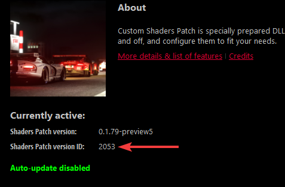

如果你需要的版本 ID 当前尚未安装，**[CSP 官方网站](https://acstuff.ru/patch/)** 会在 `Other Versions` 区域列出这些 ID。

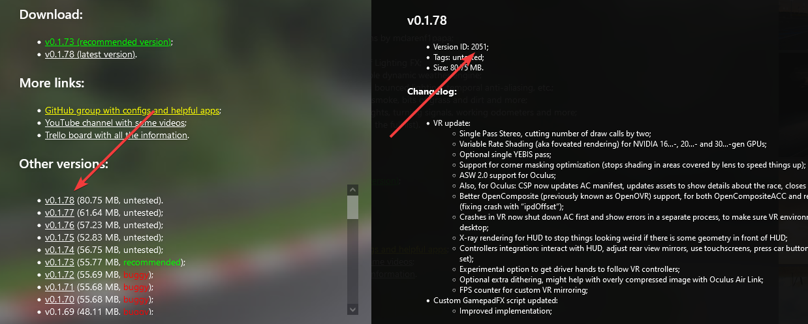

</p>
</details>

#### 向服务器添加 CSP extra server options {#extra-options-ini}

根据你是否拥有完整版 Content Manager，有两种不同的实现方式：

<Tabs groupId="content-manager">
<TabItem value="content-manager" label="使用 Content Manager（完整版）" default>

  点击预设页面底部的 `Folder` 按钮，创建一个名为 `csp_extra_options.ini` 的文件。 

  

</TabItem>
<TabItem value="manual" label="不使用 Content Manager">

  导航到服务器的 `cfg` 文件夹，创建一个名为 `csp_extra_options.ini` 的文件。 

</TabItem>
</Tabs> 

[CSP wiki 的这个页面](https://github.com/ac-custom-shaders-patch/acc-extension-config/wiki/Misc-%E2%80%93-Server-extra-options)列出了大量可用选项。  
将该页面中的选项填入 `csp_extra_options.ini` 即可，例如：

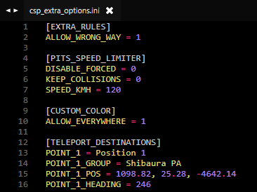 

#### 通过车辆列表（entry list）允许 extra options {#allowing-extra-options}

某些功能（如传送和改色）要求你在车辆列表（entry list）中允许车辆使用它们。  

<Tabs groupId="content-manager">
<TabItem value="content-manager" label="使用 Content Manager（完整版）" default>

  点击 `CSP` 按钮，勾选你想为该车辆启用的功能：  

  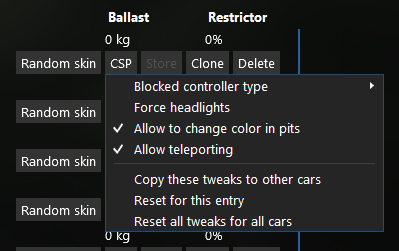

</TabItem>
<TabItem value="manual" label="不使用 Content Manager">

  - 在你的 `entry_list.ini` 中，在每个涂装（skin）末尾添加一个代码，例如：
  
  ```ini title="entry_list.ini"
  [CAR_0]
  MODEL=carname
  SKIN=skinname/ADAn
  ```

  | 代码    | 选项                     |
  | ------- | ----------------------- |
  | `/ACA3` | 允许传送                  |
  | `/ABAH` | 允许改色                  |
  | `/ADAn` | 同时允许传送和改色          |

<details>
<summary>所有选项组合</summary>
<p>**[Content Manager 是如何生成这些代码的。](https://github.com/gro-ove/actools/blob/master/AcManager.Tools/Objects/ServerDriverCspOptions.cs#L123)**</p>
<p>

| 代码    | 选项 |
| ------- | ----------------------------------------------------------------------------------------------- |
|  | 无 |
| `/AAEW` | 屏蔽键盘 |
| `/AAIV` | 屏蔽摇杆 |
| `/AAQT` | 屏蔽方向盘 |
| `/AAgf` | 强制车头灯 |
| `/ABAH` | 允许改色 |
| `/ACA3` | 允许传送 |
| `/AAMU` | 屏蔽键盘、屏蔽摇杆 |
| `/AAUS` | 屏蔽键盘、屏蔽方向盘 |
| `/AAYR` | 屏蔽摇杆、屏蔽方向盘 |
| `/AAke` | 屏蔽键盘、强制车头灯 |
| `/AAod` | 屏蔽摇杆、强制车头灯 |
| `/AAwb` | 屏蔽方向盘、强制车头灯 |
| `/ABEG` | 屏蔽键盘、允许改色 |
| `/ABIF` | 屏蔽摇杆、允许改色 |
| `/ABQD` | 屏蔽方向盘、允许改色 |
| `/ABgP` | 强制车头灯、允许改色 |
| `/ACE2` | 屏蔽键盘、允许传送 |
| `/ACI1` | 屏蔽摇杆、允许传送 |
| `/ACQz` | 屏蔽方向盘、允许传送 |
| `/ACg/` | 强制车头灯、允许传送 |
| `/ADAn` | 允许改色、允许传送 |
| `/AAsc` | 屏蔽键盘、屏蔽摇杆、强制车头灯 |
| `/AA0a` | 屏蔽键盘、屏蔽方向盘、强制车头灯 |
| `/AA4Z` | 屏蔽摇杆、屏蔽方向盘、强制车头灯 |
| `/ABME` | 屏蔽键盘、屏蔽摇杆、允许改色 |
| `/ABUC` | 屏蔽键盘、屏蔽方向盘、允许改色 |
| `/ABYB` | 屏蔽摇杆、屏蔽方向盘、允许改色 |
| `/ABkO` | 屏蔽键盘、强制车头灯、允许改色 |
| `/ABoN` | 屏蔽摇杆、强制车头灯、允许改色 |
| `/ABwL` | 屏蔽方向盘、强制车头灯、允许改色 |
| `/ACM0` | 屏蔽键盘、屏蔽摇杆、允许传送 |
| `/ACUy` | 屏蔽键盘、屏蔽方向盘、允许传送 |
| `/ACYx` | 屏蔽摇杆、屏蔽方向盘、允许传送 |
| `/ACk+` | 屏蔽键盘、强制车头灯、允许传送 |
| `/ACo9` | 屏蔽摇杆、强制车头灯、允许传送 |
| `/ACw7` | 屏蔽方向盘、强制车头灯、允许传送 |
| `/ADEm` | 屏蔽键盘、允许改色、允许传送 |
| `/ADIl` | 屏蔽摇杆、允许改色、允许传送 |
| `/ADQj` | 屏蔽方向盘、允许改色、允许传送 |
| `/ADgv` | 强制车头灯、允许改色、允许传送 |
| `/ABsM` | 屏蔽键盘、屏蔽摇杆、强制车头灯、允许改色 |
| `/AB0K` | 屏蔽键盘、屏蔽方向盘、强制车头灯、允许改色 |
| `/AB4J` | 屏蔽摇杆、屏蔽方向盘、强制车头灯、允许改色 |
| `/ACs8` | 屏蔽键盘、屏蔽摇杆、强制车头灯、允许传送 |
| `/AC06` | 屏蔽键盘、屏蔽方向盘、强制车头灯、允许传送 |
| `/AC45` | 屏蔽摇杆、屏蔽方向盘、强制车头灯、允许传送 |
| `/ADMk` | 屏蔽键盘、屏蔽摇杆、允许改色、允许传送 |
| `/ADUi` | 屏蔽键盘、屏蔽方向盘、允许改色、允许传送 |
| `/ADYh` | 屏蔽摇杆、屏蔽方向盘、允许改色、允许传送 |
| `/ADku` | 屏蔽键盘、强制车头灯、允许改色、允许传送 |
| `/ADot` | 屏蔽摇杆、强制车头灯、允许改色、允许传送 |
| `/ADwr` | 屏蔽方向盘、强制车头灯、允许改色、允许传送 |
| `/ADss` | 屏蔽键盘、屏蔽摇杆、强制车头灯、允许改色、允许传送 |
| `/AD0q` | 屏蔽键盘、屏蔽方向盘、强制车头灯、允许改色、允许传送 |
| `/AD4p` | 屏蔽摇杆、屏蔽方向盘、强制车头灯、允许改色、允许传送 |

</p>
</details>

</TabItem>
</Tabs>  

### 如何允许逆行？ {#wrong-way}

此设置也可用于消除 Shutoko Revival Project 等赛道上错误显示的逆行指示。  
如果你想在添加此设置后确保大家按正确方向行驶，请使用 [AutoModerationPlugin](./plugins/AutoModerationPlugin.mdx)。

```ini title="csp_extra_options.ini"
[EXTRA_RULES]
ALLOW_WRONG_WAY = 1 
```

如果你被传送回了维修区，请把本地游戏文件中赛道布局文件夹里的 `ai` 文件夹重命名为 `ai_off`。  
默认路径：`C:\Program Files (x86)\Steam\steamapps\common\assettocorsa\content\tracks\<trackname>\<layoutname>\ai`  

### 如何启用传送？ {#teleportation}

要启用传送，需要完成两件事：

- 在车辆列表（entry list）中允许车辆传送，[说明见这里](#allowing-extra-options)
- 向 `csp_extra_options.ini` 添加传送目的地

如果一切正确，聊天应用的扩展菜单（extras）中应该会出现 `Teleport to...` 选项：  

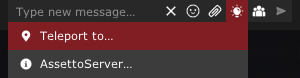

#### 在哪里可以找到 SRP 的传送点？ {#srp-teleports}

可以直接使用下面官方 SRP 服务器所用的传送点，也可以自己制作。  

<details>
<summary>**Shutoko Revival Project 官方传送点**</summary>
<p>最后更新：2024-09-14</p>
<p>

```ini title="csp_extra_options.ini"
[TELEPORT_DESTINATIONS]
POINT_0 = Position 1
POINT_0_POS = 1098.8,25.3,-4642.1
POINT_0_HEADING = 246
POINT_0_GROUP = Shibaura PA

POINT_1 = Position 2
POINT_1_POS = 1098.8,25.3,-4649.8
POINT_1_HEADING = 245
POINT_1_GROUP = Shibaura PA

POINT_2 = Position 3
POINT_2_POS = 1098.9,25.3,-4657.4
POINT_2_HEADING = 246
POINT_2_GROUP = Shibaura PA

POINT_3 = Position 4
POINT_3_POS = 1099.4,25.3,-4664.9
POINT_3_HEADING = 246
POINT_3_GROUP = Shibaura PA

POINT_4 = Position 5
POINT_4_POS = 1099.2,25.3,-4672.4
POINT_4_HEADING = 245
POINT_4_GROUP = Shibaura PA

POINT_5 = Position 1
POINT_5_POS = 5862.1,23.3,-4649
POINT_5_HEADING = 267
POINT_5_GROUP = Tatsumi PA

POINT_6 = Position 2
POINT_6_POS = 5850.9,22.9,-4644.6
POINT_6_HEADING = 268
POINT_6_GROUP = Tatsumi PA

POINT_7 = Position 3
POINT_7_POS = 5839.7,22.5,-4640
POINT_7_HEADING = 268
POINT_7_GROUP = Tatsumi PA

POINT_8 = Position 1
POINT_8_POS = -308.6,15.5,6143.8
POINT_8_HEADING = 68
POINT_8_GROUP = Daishi PA

POINT_9 = Position 2
POINT_9_POS = -308.5,15.5,6150.7
POINT_9_HEADING = 68
POINT_9_GROUP = Daishi PA

POINT_10 = Position 3
POINT_10_POS = -308.1,15.4,6157.9
POINT_10_HEADING = 66
POINT_10_GROUP = Daishi PA

POINT_11 = Position 1
POINT_11_POS = -230.1,12.3,1360
POINT_11_HEADING = 104
POINT_11_GROUP = Heiwajima PA North

POINT_12 = Position 2
POINT_12_POS = -234.9,12.3,1354.1
POINT_12_HEADING = 106
POINT_12_GROUP = Heiwajima PA North

POINT_13 = Position 3
POINT_13_POS = -239.8,12.3,1348.1
POINT_13_HEADING = 105
POINT_13_GROUP = Heiwajima PA North

POINT_14 = Position 1
POINT_14_POS = 964.9,6.7,-126.1
POINT_14_HEADING = 156
POINT_14_GROUP = Oi PA

POINT_15 = Position 2
POINT_15_POS = 964.9,6.8,-138
POINT_15_HEADING = 156
POINT_15_GROUP = Oi PA

POINT_16 = Position 3
POINT_16_POS = 964.8,6.8,-151.2
POINT_16_HEADING = 156
POINT_16_GROUP = Oi PA

POINT_17 = Position 1
POINT_17_POS = -10854.3,12,13422.8
POINT_17_HEADING = 287
POINT_17_GROUP = Mirai - Kinko JCT

POINT_18 = Position 2
POINT_18_POS = -10846.2,12,13415.8
POINT_18_HEADING = 283
POINT_18_GROUP = Mirai - Kinko JCT

POINT_19 = Position 1
POINT_19_POS = -83.8,7.1,10983.1
POINT_19_HEADING = 273
POINT_19_GROUP = Bayshore North - Kawasaki Port

POINT_20 = Position 2
POINT_20_POS = -103,7.7,10993.2
POINT_20_HEADING = 274
POINT_20_GROUP = Bayshore North - Kawasaki Port

POINT_21 = Position 1
POINT_21_POS = 2512.1,12.2,-9223.3
POINT_21_HEADING = 231
POINT_21_GROUP = C1 Outer - Edobashi JCT

POINT_22 = Position 2
POINT_22_POS = 2503.3,12,-9225.6
POINT_22_HEADING = 232
POINT_22_GROUP = C1 Outer - Edobashi JCT

POINT_23 = Position 1
POINT_23_POS = -4251.7,32.9,-10032.5
POINT_23_HEADING = 208
POINT_23_GROUP = Shinjuku Station

POINT_24 = Position 2
POINT_24_POS = -4244.1,32.9,-10016.8
POINT_24_HEADING = 159
POINT_24_GROUP = Shinjuku Station

POINT_25 = Position 3
POINT_25_POS = -4242.9,33,-9995.6
POINT_25_HEADING = 160
POINT_25_GROUP = Shinjuku Station

POINT_26 = Position 1
POINT_26_POS = -6147.9,29.6,13722.3
POINT_26_HEADING = 346
POINT_26_GROUP = Yokohama - Daikoku

POINT_27 = Position 2
POINT_27_POS = -6151.9,29.7,13702.2
POINT_27_HEADING = 347
POINT_27_GROUP = Yokohama - Daikoku

POINT_28 = Position 1
POINT_28_POS = -135.8,6.6,1475.1
POINT_28_HEADING = 128
POINT_28_GROUP = Heiwajima PA - South

POINT_29 = Position 2
POINT_29_POS = -141.2,6.6,1463.3
POINT_29_HEADING = 132
POINT_29_GROUP = Heiwajima PA - South

POINT_30 = Position 3
POINT_30_POS = -146.6,6.5,1451.8
POINT_30_HEADING = 130
POINT_30_GROUP = Heiwajima PA - South

POINT_31 = Position 2
POINT_31_POS = 2179.8,-1.7,-7541.2
POINT_31_HEADING = 291
POINT_31_GROUP = C1 Inner - Ginza

POINT_32 = Position 1
POINT_32_POS = 4104.2,-7.8,8489
POINT_32_HEADING = 304
POINT_32_GROUP = Bayshore North - Tamagawa River Tunnel

POINT_33 = Position 2
POINT_33_POS = 4121,-8.3,8463.5
POINT_33_HEADING = 303
POINT_33_GROUP = Bayshore North - Tamagawa River Tunnel

POINT_34 = Position 1
POINT_34_POS = 3278.4,0.8,4292.5
POINT_34_HEADING = 197
POINT_34_GROUP = Bayshore South - Haneda Airport

POINT_35 = Position 2
POINT_35_POS = 3265.1,0.7,4278.1
POINT_35_HEADING = 199
POINT_35_GROUP = Bayshore South - Haneda Airport

POINT_36 = Position 1
POINT_36_POS = -7478.1,13,16477.6
POINT_36_HEADING = 22
POINT_36_GROUP = Kariba - Sakuragicho

POINT_37 = Position 1
POINT_37_POS = 767.5,16.5,-9914.9
POINT_37_HEADING = 87
POINT_37_GROUP = C1 Inner - Kitanomaru

POINT_38 = Position 2
POINT_38_POS = 782.8,16.5,-9921.3
POINT_38_HEADING = 89
POINT_38_GROUP = C1 Inner - Kitanomaru

POINT_39 = Position 1
POINT_39_POS = 4522.3,14,-8210.6
POINT_39_HEADING = 350
POINT_39_GROUP = Belt Inner - Fukuzumi

POINT_40 = Position 2
POINT_40_POS = 4524.7,14.3,-8199.7
POINT_40_HEADING = 349
POINT_40_GROUP = Belt Inner - Fukuzumi

POINT_41 = Position 1
POINT_41_POS = -2533.6,11,8864.5
POINT_41_HEADING = 86
POINT_41_GROUP = Yokohane - Kawasaki

POINT_42 = Position 1
POINT_42_POS = 1371.3,9.8,-6547.1
POINT_42_HEADING = 117
POINT_42_GROUP = C1 Outer - Bayshore Access

POINT_43 = Position 2
POINT_43_POS = 1363.8,9.7,-6537.6
POINT_43_HEADING = 118
POINT_43_GROUP = C1 Outer - Bayshore Access

POINT_44 = Position 1
POINT_44_POS = 318,13,-5719.1
POINT_44_HEADING = 63
POINT_44_GROUP = C1 Outer - Shibakoen

POINT_45 = Position 2
POINT_45_POS = 305.9,12.8,-5720.3
POINT_45_HEADING = 61
POINT_45_GROUP = C1 Outer - Shibakoen

POINT_46 = Position 1
POINT_46_POS = -2171.6,36.8,-6448
POINT_46_HEADING = 72
POINT_46_GROUP = Shibuya - Takigicho

POINT_47 = Position 2
POINT_47_POS = -2159.5,36.8,-6449.3
POINT_47_HEADING = 73
POINT_47_GROUP = Shibuya - Takigicho

POINT_48 = Position 1
POINT_48_POS = -4581.4,34.7,-6013.5
POINT_48_HEADING = 80
POINT_48_GROUP = Shibuya Access

POINT_49 = Position 2
POINT_49_POS = -4754.6,34.7,-5830
POINT_49_HEADING = 12
POINT_49_GROUP = Shibuya Access

POINT_50 = Position 1
POINT_50_POS = -4305.1,36.8,-8883.1
POINT_50_HEADING = 176
POINT_50_GROUP = Yoyogi PA

POINT_51 = Position 2
POINT_51_POS = -4313.3,36.7,-8883.1
POINT_51_HEADING = 174
POINT_51_GROUP = Yoyogi PA

POINT_52 = Position 3
POINT_52_POS = -4324.5,36.7,-8882.3
POINT_52_HEADING = 174
POINT_52_GROUP = Yoyogi PA

POINT_53 = Position 1
POINT_53_POS = 100.3,12.2,-5830.6
POINT_53_HEADING = 191
POINT_53_GROUP = C1 Inner - Shibakoen

POINT_54 = Position 2
POINT_54_POS = 92.5,12.2,-5841.1
POINT_54_HEADING = 193
POINT_54_GROUP = C1 Inner - Shibakoen

POINT_55 = Position 1
POINT_55_POS = 550.8,12.4,-3796.7
POINT_55_HEADING = 133
POINT_55_GROUP = Yokohane South - Shinagawa

POINT_56 = Position 1
POINT_56_POS = -7075.9,32.9,16318.3
POINT_56_HEADING = 351
POINT_56_GROUP = Bayshore North - Honmoku JCT

POINT_57 = Position 2
POINT_57_POS = -7079,33.2,16306.4
POINT_57_HEADING = 351
POINT_57_GROUP = Bayshore North - Honmoku JCT

POINT_58 = Service Station 1
POINT_58_POS = 1672.2,12.6,-7998.5
POINT_58_HEADING = 96
POINT_58_GROUP = Yaesu

POINT_59 = Service Station 2
POINT_59_POS = 1699,12.4,-8024.1
POINT_59_HEADING = 120
POINT_59_GROUP = Yaesu

POINT_60 = Service Station 3
POINT_60_POS = 1606.8,12.7,-7968.5
POINT_60_HEADING = -96
POINT_60_GROUP = Yaesu

POINT_61 = Service Station 4
POINT_61_POS = 1595.9,12.7,-7964.8
POINT_61_HEADING = -96
POINT_61_GROUP = Yaesu

```

</p>
</details>

#### 如何制作自己的传送点？ {#making-teleports}

你可以使用 Objects Inspector 或 [comfy map 应用](https://www.racedepartment.com/downloads/comfy-map.52623/)来确定坐标和朝向。  
格式如下：

```ini
POINT_0 = Name               ; Destination name
POINT_0_GROUP = Group Name   ; Optional group
POINT_0_POS = X, Y, Z        ; Coordinates
POINT_0_HEADING = 0          ; Heading angle in degrees
```

:::note

comfy map 应用并不是创建传送点、启用或使用传送功能的必需品。

:::

### 如何启用改色？ {#color-changing}

要启用改色，需要完成两件事：

- 在车辆列表（entry list）中允许车辆改色，[说明见这里](#allowing-extra-options)
- 在 `csp_extra_options.ini` 中添加以下内容

请注意，这只对使用常规涂装（skin）的车辆有效，基于贴图的涂装（livery）不受影响。

```ini title="csp_extra_options.ini"
[CUSTOM_COLOR]
ALLOW_EVERYWHERE = 1   ; Change car colors anywhere as long as the car is stopped.
```

:::note

如果得到允许，AI 车辆会以随机颜色生成。 

:::

### 如何提高维修区内的限速？ {#pit-speed-limiter}

```ini title="csp_extra_options.ini"
[PITS_SPEED_LIMITER]
KEEP_COLLISIONS = 0   ; Activate collisions between cars in pits
SPEED_KMH = 80        ; Alter pits speed limiter value; default is 80
```

### 如何使用服务器脚本（Server Scripts）？ {#csp-server-scripts}

:::note

请注意，服务器脚本（Server Scripts）与 AssettoServer 插件是两回事，我们不在 Discord 上为它们提供支持。

:::

<Tabs groupId="server-scripts">
<TabItem value="remote" label="从远程 URL 加载" default>

当你的脚本托管在外部服务上时，例如：

- Github / Pastebin
- 你自己的服务器（IIS 或类似服务）

进入服务器的 `cfg` 文件夹，打开 `csp_extra_options.ini` 并添加以下内容：

```ini title="csp_extra_options.ini"
[SCRIPT_...]
SCRIPT = "https://pastebin.com/raw/00000000000"    ; Change this to the url of your script
```

</TabItem>
<TabItem value="wwwroot" label="使用 AssettoServer 的 HTTP 服务器" default>

除了把脚本托管在外部，你还可以直接使用 AssettoServer 的 HTTP 服务器来提供脚本。  

- 将脚本文件放入服务器的 `wwwroot` 文件夹。
- 进入服务器的 `cfg` 文件夹，打开 `csp_extra_options.ini` 并添加以下内容：  
  ```ini title="csp_extra_options.ini"
  [SCRIPT_...]
  SCRIPT = "http://<public ip>:<http port>/static/<filename.lua>"    ; Replace the `<placeholders>`
  ```

</TabItem>
</Tabs> 

[更多可用选项请见这里。](https://github.com/CheesyManiac/cheesy-lua/wiki/Extra-CSP-Server-Config-Values#server-scripts)

## 如何允许玩家下载缺失的内容？ {#download-missing-content}

可以让玩家在 Content Manager 的服务器浏览器中下载缺失的内容，例如赛道和车辆。
既可以在内容存储在 GoogleDrive 之类第三方文件托管服务上时提供直接下载链接，也可以把内容直接托管在服务器上。

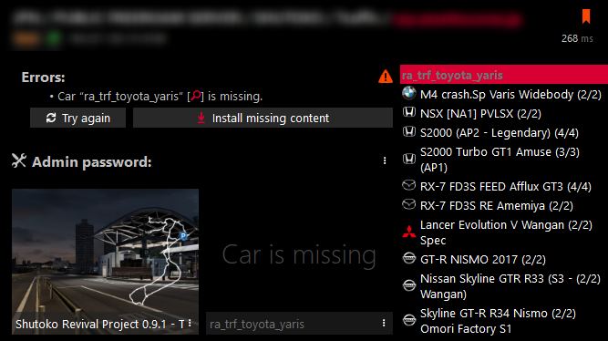

### 通过第三方文件托管服务 {#remote-downloads}

:::caution

请使用你所用内容作者提供的下载链接，除非你被明确允许自行重新上传。

:::

<Tabs groupId="content-manager">
<TabItem value="content-manager" label="使用 Content Manager（完整版）" default>

  - 进入服务器预设的 `Details` 标签页。
  - 在 `Share Mode` 标签中选择 "Download URL"，并把直接下载链接粘贴到 `Download from` 字段。
  - `Version Required` 保持原样即可，CM 会自动为你填写，然后保存预设。
  - 服务器目录下会创建 `cm_content` 文件夹，其中包含一个 `content.json` 文件。  
  - 点击预设页面底部的 `Folder` 按钮，打开 `extra_cfg.yml` 并将 `EnableServerDetails` 设为 `true`。  
    ```yaml title="extra_cfg.yml"
    # Enable server details in CM. Required for server description
    EnableServerDetails: true
    ```

  :::caution

  使用打包（packing）功能时不会包含 `cm_content` 文件夹，需要手动复制。

  :::

  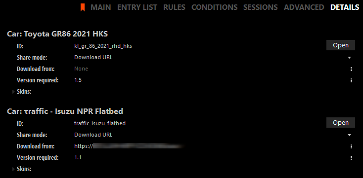

</TabItem>
<TabItem value="manual" label="不使用 Content Manager">

  - 导航到服务器的 `cfg` 文件夹。
  - 创建一个 `cm_content` 文件夹，并在其中创建一个名为 `content.json` 的文件。
  - 现在你可以在 `content.json` 中像这样配置下载链接：

  ```json
  {
    "cars": {
      "car_name_here": {
        "url": "download url here",
        "version": "version here"
      },
      "car_name_two": {
        "url": "download url here",
        "version": "version here"
      }
    },
    "track": {
      "url": "download url here",
      "version": "version here"
    }
  }
  ```

  - `version` 必须与车辆/赛道内容标签页中 `Author` 字段显示的版本一致。  
    如果该模组没有版本号，直接删掉 `"version": "version here"` 这一行即可。
  
    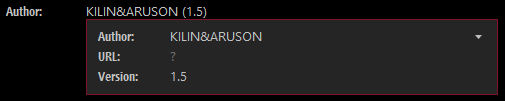

  - 进入服务器的 `cfg` 文件夹，打开 `extra_cfg.yml` 并将 `EnableServerDetails` 设为 `true`。  
    ```yaml title="extra_cfg.yml"
    # Enable server details in CM. Required for server description
    EnableServerDetails: true
    ```

</TabItem>
</Tabs>

### 直接通过服务器提供 {#direct-downloads}

<Tabs groupId="content-manager">
<TabItem value="content-manager" label="使用 Content Manager（完整版）" default>

  - 进入服务器预设的 `Details` 标签页。
  - 在 `Share Mode` 标签中选择 "Download URL"，并把直接下载链接粘贴到 `Share from server` 字段。
  - 点击 `Packed archive` 一行上的三个小点，如果你已有打包好的压缩包就选择 `Select existing archive`，否则选择 `Repack` 进行打包。  
    
    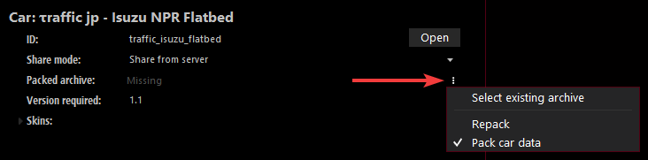

  - `Version Required` 保持原样即可，CM 会自动为你填写，然后保存预设。
  - 服务器目录下会创建 `cm_content` 文件夹，其中包含一个 `content.json` 文件。  
    如果你使用了 `Repack` 选项，生成的压缩包也会被添加到该文件夹中。  
  - 点击预设页面底部的 `Folder` 按钮，打开 `extra_cfg.yml` 并将 `EnableServerDetails` 设为 `true`。  
    ```yaml title="extra_cfg.yml"
    # Enable server details in CM. Required for server description
    EnableServerDetails: true
    ```

  :::caution
  
  使用打包功能时不会包含 `cm_content` 文件夹，需要手动复制。

  Content Manager 会自动为每个压缩包填写完整路径。  
  如果你打算移动这些文件（例如移到 VPS 上），则需要更新 `content.json` 中每个条目的 `file:` 参数，使其指向新位置。  
  
  :::

</TabItem>
<TabItem value="manual" label="不使用 Content Manager">

  - 导航到服务器的 `cfg` 文件夹。
  - 创建一个 `cm_content` 文件夹，并在其中创建一个名为 `content.json` 的文件。
  - 现在你可以在 `content.json` 中像这样配置每个压缩包的路径：

  ```json
  {
    "cars": {
      "car_name_here": {
      "file": "path to archive here",
        "version": "version here"
      },
      "car_name_two": {
      "file": "path to archive here",
        "version": "version here"
      }
    },
    "track": {
      "file": "path to archive here",
      "version": "version here"
    }
  }
  ```

  - `version` 必须与车辆/赛道内容标签页中 `Author` 字段显示的版本一致。  
    如果该模组没有版本号，直接删掉 `"version": "version here"` 这一行即可。

    

  - 进入服务器的 `cfg` 文件夹，打开 `extra_cfg.yml` 并将 `EnableServerDetails` 设为 `true`。  
    ```yaml title="extra_cfg.yml"
    # Enable server details in CM. Required for server description
    EnableServerDetails: true
    ```

</TabItem>
</Tabs>

  :::note

  除了指定完整文件路径外，你也可以只提供相对于 AssettoServer 根目录的路径。  
  例如：`"file": "cfg/cm_content/car_name.zip",`

  :::

## 如何启用自定义 Steam API 替换（Custom Steam API Replacement）？ {#custom-steam-api}

**AssettoServer 不支持盗版，因此购买 Assetto Corsa 以及你想使用的内容所需的 DLC 是绕不过去的。**  
如果你过去使用过盗版 Assetto Corsa，而现在已全部购买正版，请务必：  
- 通过 Steam 校验你的游戏文件
- 在 Content Manager 常规设置中，把 Assetto Corsa 游戏文件夹改为你的 Steam 安装位置。  
默认路径：`C:\Program Files (x86)\Steam\steamapps\common\assettocorsa\`

## 如何排版服务器描述？ {#server-description}

**换行**  
`|-` 修饰符可能是正确排版描述时最重要的一环。  
更多信息请阅读此网站：https://yaml-multiline.info/

**BBcode**  
Content Manager 中的描述使用 BBcode 标签，参见：https://www.bbcode.org/reference.php  
添加图片请使用 `[img=<link>]img1[/img]`  
请注意，Content Manager 并不支持 BBcode 的所有功能。

**示例描述，请勿把这段内容添加到 `extra_cfg.yml` 底部。**

```yaml title="extra_cfg.yml"
# Server description shown in Content Manager. EnableServerDetails must be on
ServerDescription: |-
  [img=https://assettoserver.org/img/as-logo-cm.png]AssettoServer Logo[/img]

  [size=16]                   [b]UNOFFICIAL AI TRAFFIC TEST SERVER[/b]

                Car and track downloads, installation help:
                          [url=https://discord.com/invite/shutokorevivalproject]Shutoko Revival Project Discord[/url]
                              Server news and feedback:
                      [url=https://discord.gg/uXEXRcSkyz]AssettoServer Development Discord[/url]
                                    [color=#FF424D]Support the server:[/color]
                                              [url=https://www.patreon.com/assettoserver]Patreon[/url]
  [size=22][b]Rules[/b][/size]
  [color=#E82A1F][size=18][b]- Keep chat app open at all times.[/b][/size][/color]
  [size=18][color=#E82A1F][b]- [u]PLEASE TURN YOUR LIGHTS ON[/u][size=16]
    when its night so other drivers can see you.[/size][/b][/color][/size]
  - Don't run into other cars on purpose.
  - Do not park or block the road.
    Pull off as much to the side as possible or return to pits.
  - Be respectful of other drivers, keep a comfortable distance
    when driving with others.
  - Don't drive into oncoming traffic. This is Japan.
    Drive on the left side of the road.
  - Don't cause drama in the chat. This includes spamming and
    harassment.
  - If you dont have Sol working, or are otherwise in doubt,
    keep your lights on.
```
