import Tabs from '@theme/Tabs';
import TabItem from '@theme/TabItem';

## Introduction {#intro}

本页面将带你完成在 Windows 机器上搭建自己的 AssettoServer 自由漫游服务器的初始设置过程。  
我们将使用完整版 Content Manager 搭建服务器，讲解如何配置 AI 车流、如何用一些设置来自定义服务器，并学习如何排查一些较常见的服务器崩溃原因。

## Prerequisites {#prerequisites}

要跟随本指南，你需要准备以下内容：

- AssettoServer 的**最新**版本。
- Content Manager 的**完整版**。
- **Shutoko Revival Project** 赛道。
- 一条为 **Shutoko Revival Project** 制作的 `fast_lane.ai(p)`。
- 对文本编辑器的基本使用有了解。

### 下载最新版本的 AssettoServer {#latest-assettoserver-version}

1. 前往 [AssettoServer 的最新 GitHub 发布页](https://github.com/compujuckel/AssettoServer/releases/latest)。

2. 在发布页的 Assets 区域点击 `assetto-server-win-x64.zip` 下载该文件。

   

### 购买 Content Manager 完整版 {#content-manager-fullversion}

:::note
即使没有 Content Manager 完整版，你也可以托管、配置服务器并在其上游玩。  
为了简单起见，我们将使用完整版来为我们生成所需文件。  
如果你不想购买完整版，可以参考 [Kunos 服务器手册](https://www.assettocorsa.net/forum/index.php?faq/assetto-corsa-dedicated-server-manual.28/) 手动创建这些文件。
:::

1. 通过[官方网站](https://assettocorsa.club/content-manager.html)购买 Content Manager 完整版，或成为 [x4fabs 的 Patreon](https://www.patreon.com/user?u=11605034) 赞助者。

2. 将你通过电子邮件收到的密钥输入 Content Manager。

   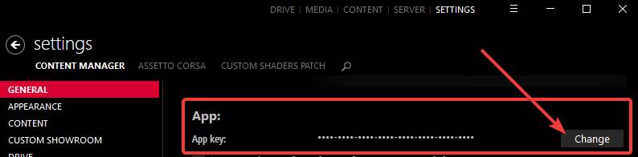

### 下载 Shutoko Revival Project 赛道和 AI 行驶线路 {#downloading-srp}

:::note
只要有某条赛道的 `fast_lane.ai(p)`，你就可以使用任何赛道。  
在本指南中，我们使用 SRP 赛道，因为它是最受欢迎的赛道之一。
:::

1. 前往 [Shutoko Revival Project 官网](https://shutokorevivalproject.com/)

2. 下载并安装最新的**稳定**版本。

   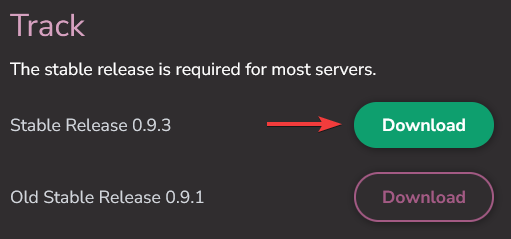

   如果你在安装赛道时需要帮助，请使用 [Shutoko Revival Project Discord](https://discord.gg/shutokorevivalproject) 的 [#help 频道](https://discord.com/channels/500246817833877505/504100944846520321)

3. 点击本句中的链接或本页顶部导航栏中的 Discord 图标，加入 [AssettoServer Discord](https://discord.gg/uXEXRcSkyz)。  

   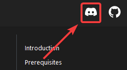

4. 进入 [#ai-spline-releases](https://discord.com/channels/890676433746268231/929390922624532480) 频道，打开 `Pinned Messages`（置顶消息），下载为 Shutoko Revival Project 制作的行驶线路。

   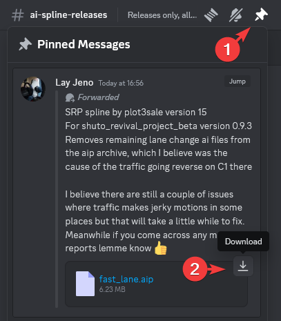

## 初始设置 {#initial-setup}

### 预配置 {#preconfiguration}

目前，我们将使用 AssettoServer 默认车流设置所需的最少车辆数。  

1. 首先切换到 Content Manager 的 `Server` 标签页  
   如果你没有这个菜单，请在 Content Manager 设置中按如下方式启用：

   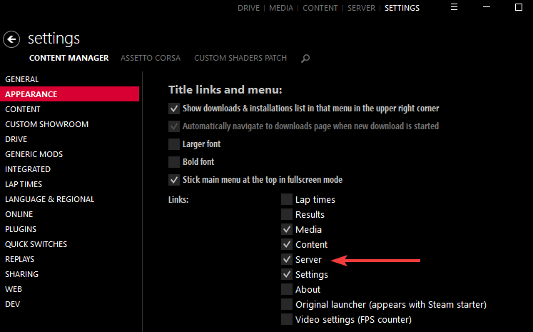

2. 点击左侧列表中的 `SERVER_00`，再点击 `SERVER_00` 文本框，即可修改服务器名称。

   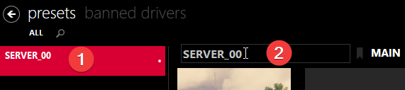

3. 点击 Imola 的赛道预览图，把赛道改为 Shutoko Revival Project - Main Layout。

   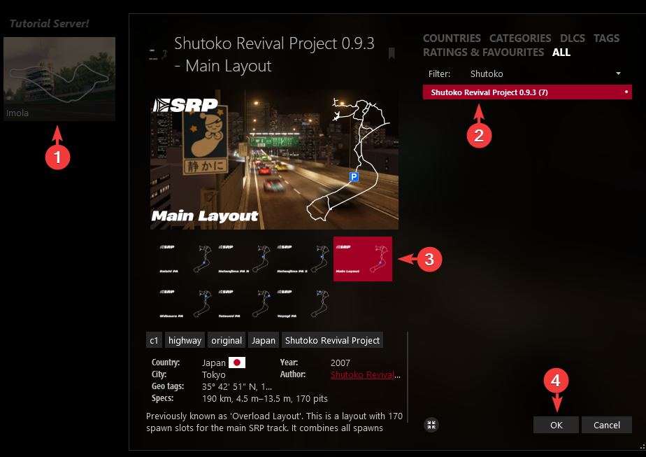

4. 点击 `Admin password`（管理员密码）字段，输入一个至少 8 个字符长的密码。

5. 勾选 `Make server public (show on lobby)`（公开服务器（在大厅中显示））复选框。

6. 把 `Capacity`（人数上限）滑块拖到 11。

7. 点击 `ENTRY LIST` 标签页，再点击 (+) 向列表中添加车辆。  
   按以下顺序添加这些车辆：

   - 1 辆 RUF CTR Yellowbird
   - 5 辆 Audi S1
   - 5 辆 Toyota GT-86
   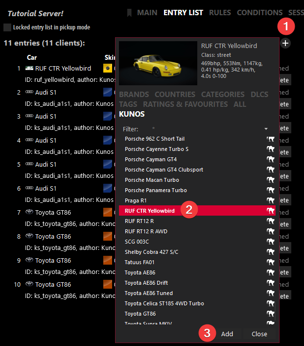

   :::caution
   添加更多车辆时，记得同步调高 `Capacity` 滑块，否则只有前 11 辆车会被加载。

   添加的车辆数不要超过所选赛道布局可用的维修区数量。  
   上限显示在 `Capacity` 滑块下方，Shutoko Revival Project - Main Layout 的上限如下所示：  

   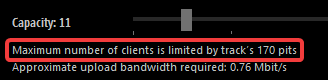

   无视此上限会导致加入服务器时游戏崩溃。
   :::

8. 打开 `RULES` 标签页，按你的喜好配置该页面。

   一些建议：

   - 取消勾选 `Virtual Mirror`（虚拟后视镜），因为它会强制虚拟后视镜始终开启，这可能并不合人意。
   - 把 `Allowed tyres out` 滑块向左拖到 `Any` 位置。

   我们将使用以下设置：

   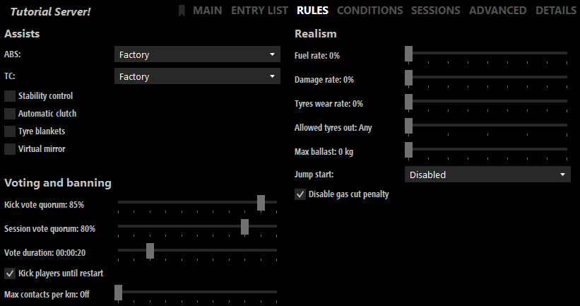

9. 打开 `CONDITIONS` 标签页，按你的喜好配置该页面。  
   保持大的 `Time`（时间）和 `Time Multiplier`（时间倍率）滑块不变。
   - 在 `Weather`（天气）区域，把开关切到 `WeatherFX`，然后选择你想要的天气。  
      如果列表中没有你想要的天气，请在解压步骤之后阅读[如何更改天气](#changing-weather)的"专用文件夹"版本。
   - 点击天气下拉框旁边的三个小点。
   - 启用并设置你想要的时间/日期/时间倍率。

   我们将使用以下设置：

   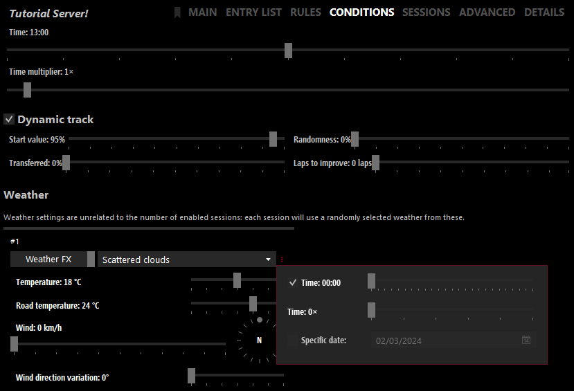

10. 打开 `SESSIONS` 标签页，按如下方式配置：

   - 勾选 `Pickup mode`（自由加入模式）和 `Loop mode`（循环模式），保持 `Locked entry list in pickup mode`（自由加入模式下锁定车辆列表）为未勾选。
   - 取消勾选 `Booking`、`Qualifying` 和 `Race`。
   - 把 `Practice`（练习）设为合理的时长，比如 2 小时。你可以设得更长，但 999999999 这样的时长很可能引发问题，也没有必要。

   我们将使用以下设置：  

   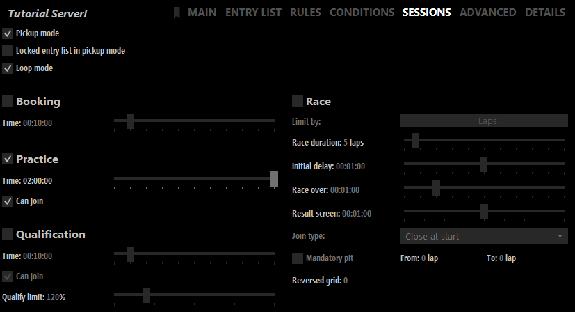

11. 在预设底部点击 `Save`（保存）。  

    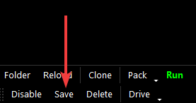

### 选择服务器的运行方式 {#where-to-run}

服务器有两种运行方式：在 Content Manager 内运行，或从专用文件夹运行。  
在 Content Manager 内运行是上手最快的方式，而使用专用文件夹则拥有更好的可移植性，也为高级配置提供了更大的灵活性。  
另外请注意，原版服务器的功能并未全部得到支持，因此 CM 中显示的某些设置不会按预期工作。

<Tabs groupId="install-method" >
  <TabItem value="folder" label="专用文件夹">

#### 打包服务器预设 {#preset-packing}

服务器配置完成后，我们可以使用打包功能把所需的所有文件导出为一个 .zip 文件。

1. 在我们刚刚保存服务器预设的同一栏中，点击 `Pack`（打包）。

2. 选择 `Windows` 作为目标，取消勾选 `Include executable`（包含可执行文件）和 `Pack into single exe-file`（打包为单一 exe 文件）。

3. 点击 `Pack` 并保存。  

   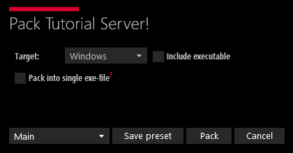

#### 解压 AssettoServer 和打包好的预设 {#server-extraction}

现在你的电脑上应该有以下 .zip 文件：

- `assetto-server-win-x64.zip`
- 我们刚刚打包的服务器预设，文件名类似 `<PresetName>-X-XXXXXXXX-XXXXXX.zip`

新建一个文件夹，把两个 .zip 文件的内容都解压进去。  
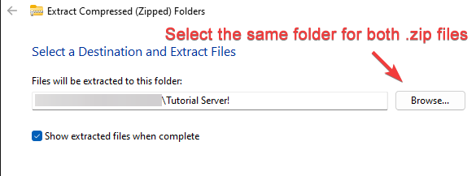

:::caution
你的服务器文件夹中**不应**存在名为 `<PresetName>-X-XXXXXXXX-XXXXXX` 的文件夹。  
如果存在，请把其中的文件夹移到主文件夹中。

你的服务器文件夹应该像这样：  
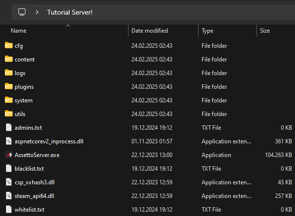
:::

</TabItem>
<TabItem value="cm" label="在 Content Manager 内">

#### 解压 AssettoServer 并替换 acserver.exe {#acserver-replacement}

导航到 Assetto Corsa 安装目录下的 `\server` 文件夹。  
默认情况下，该文件夹位于 `C:\Steam\steamapps\common\assettocorsa\server`。

1. 把 `assetto-server-win-x64.zip` 解压到 `C:\Steam\steamapps\common\assettocorsa\server` 文件夹，使 `AssettoServer.exe` 与 `acServer.exe` 位于同一文件夹。

2. 把 `acServer.exe` 重命名为其他名称。（例如 `acServer_default.exe`）

3. 把 `AssettoServer.exe` 重命名为 `acServer.exe`

</TabItem>
</Tabs>

### 首次启动与 AssettoServer 车流基础配置 {#first-launch-traffic-basics}

<Tabs groupId="install-method">
  <TabItem value="folder" label="专用文件夹">

双击 `AssettoServer.exe` 启动服务器。

  </TabItem>
  <TabItem value="cm" label="在 Content Manager 内">

在 Content Manager 中，点击预设的 `Run`（运行）按钮。

  </TabItem>
</Tabs>

你可能会收到来自 Windows 防火墙或 Windows Defender 的如下弹窗提示：

<Tabs>
<TabItem value="firewall" label="Windows 防火墙" default>

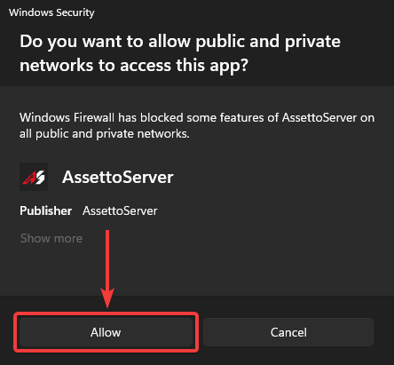

</TabItem>
<TabItem value="defender" label="Windows Defender">

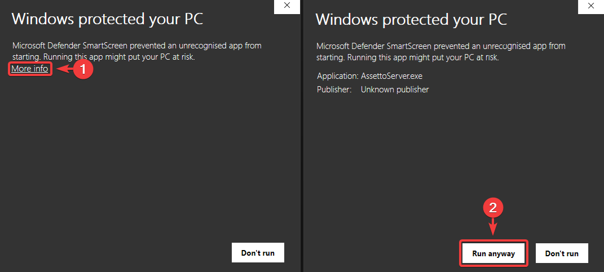

</TabItem>
</Tabs>

<Tabs groupId="install-method" className="hidden-tab-labels">
  <TabItem value="folder" label="专用文件夹">

允许 AssettoServer 启动后，你应该会看到类似这样的内容：

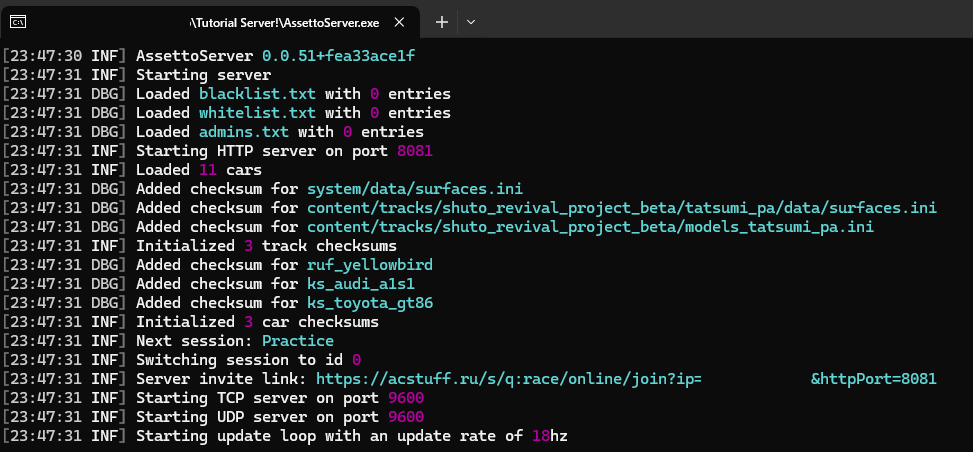

  </TabItem>
  <TabItem value="cm" label="在 Content Manager 内">

允许 AssettoServer 启动后，打开预设的 `LOGS` 标签页，你应该会看到类似这样的内容：

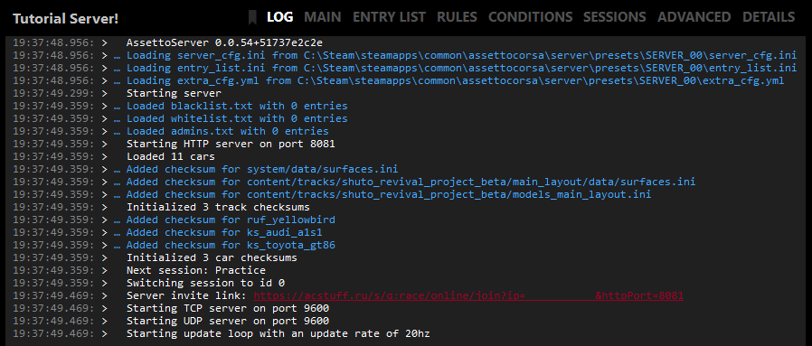

  </TabItem>
</Tabs>

:::caution
  你的日志中还可能出现以下错误消息：  
   ```
   Your ports are not forwarded correctly. The server will continue to run, but players outside of your network won't be able to join.
   To fix this, you'll need to go into your router settings and create Port Forwards for these ports:
   Port 9600 UDP
   Port 9600 TCP
   Port 8081 TCP
   Local IP: XXX.XXX.XXX.XXX
   Router Page: http://XXX.XXX.XXX.X/
   Since Instructions are different for each router, search in Google for "how to port forward" with the name of your router and/or ISP.
   ```

  这意味着你需要在路由器中开放 AssettoServer 使用的端口，并可能需要在防火墙中为 AssettoServer 添加例外。  

  由于每台路由器 / 每个 ISP 的说明都不同，我们不会在这里或我们的 Discord 上讲解具体做法。  
  请参阅路由器的用户手册，或在 Google 中搜索 "how to port forward" 并加上你的路由器和/或 ISP 的名称。
:::

<Tabs groupId="install-method" className="hidden-tab-labels">
  <TabItem value="folder" label="专用文件夹">

1. 关闭终端，导航到服务器主目录中的 `cfg` 文件夹。

  </TabItem>
  <TabItem value="cm" label="在 Content Manager 内">

1. 点击 `Stop`（停止）按钮，然后点击预设页面底部的 `Folder`（文件夹）按钮。

  </TabItem>
</Tabs>


2. 用你喜欢的文本编辑器打开 `extra_cfg.yml`，并设置 `EnableAi: true`。

   ```yaml title="extra_cfg.yml"
   # Enable AI traffic
   EnableAi: true
   ```

3. 保存并关闭该文件，然后打开 `entry_list.ini`。  
   对于第一辆车，也就是我们要驾驶的那辆 RUF，我们在 `RESTRICTOR=0` 下面添加一行。

   ```ini title="entry_list.ini"
   [CAR_0]
   MODEL=ruf_yellowbird
   SKIN=00_yellowbird_black
   SPECTATOR_MODE=0
   DRIVERNAME=
   TEAM=
   GUID=
   BALLAST=0
   RESTRICTOR=0
   // highlight-next-line
   AI=none
   ```

   对于其余车辆，我们改为添加 `AI=fixed` 这一行，因为我们要把它们用作 AI 车流。

   ```ini title="entry_list.ini"
   [CAR_1]
   MODEL=ks_audi_a1s1
   SKIN=00_sepang_blue_pearl_effect_br
   SPECTATOR_MODE=0
   DRIVERNAME=
   TEAM=
   GUID=
   BALLAST=0
   RESTRICTOR=0
   // highlight-next-line
   AI=fixed
   ```

4. 保存并关闭该文件，然后打开 `server_cfg.ini`。  
   找到 `[PRACTICE]` 会话，向其中添加一行 `INFINITE=1`。

   ```ini title="server_cfg.ini"
   [PRACTICE]
   NAME=Practice
   TIME=120
   IS_OPEN=1
   // highlight-next-line
   INFINITE=1
   ``` 

   这会让会话无限延长，避免 2 小时一到就重置会话、把所有人送回维修区。  
   请注意，Content Manager 和各类应用会显示一个 `time left`（剩余时间），这是正常现象，并不代表它没有生效。

<Tabs groupId="install-method" className="hidden-tab-labels">
  <TabItem value="folder" label="专用文件夹">

5. 保存并关闭文件后，导航到赛道的内容文件夹，即 `\<ServerName>\content\tracks\shuto_revival_project_beta`。  
  新建一个名为 `ai` 的文件夹，把我们之前下载的 `fast_lane.aip` 放进去。

   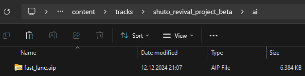

6. 现在回到服务器主目录，再次启动 `AssettoServer.exe`。  
   然后打开 Content Manager，进入 `Drive` 标签页，选择 `Online` 标签页，再选择 `LAN` 标签页。  
   服务器现在会出现在服务器列表中。这可能需要一点时间，所以你可能需要刷新几次列表。

  </TabItem>
  <TabItem value="cm" label="在 Content Manager 内">

5. 保存并关闭文件后，导航到赛道的内容文件夹，即 `\<ServerName>\content\tracks\shuto_revival_project_beta`。  
  新建一个名为 `ai` 的文件夹，把我们之前下载的 `fast_lane.aip` 放进去。

   

6. 现在回到预设，再次点击 `Run` 按钮。  
   然后进入 `Drive` 标签页，选择 `Online` 标签页，再选择 `LAN` 标签页。  
   服务器现在会出现在服务器列表中。这可能需要一点时间，所以你可能需要刷新几次列表。

  </TabItem>
</Tabs>

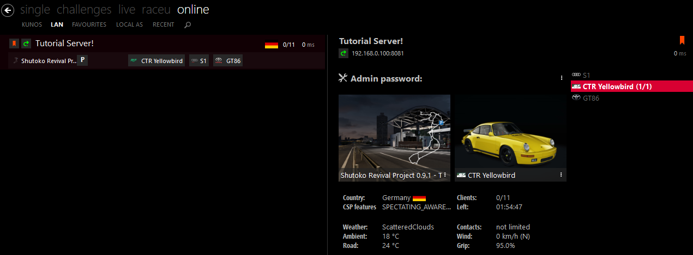

7. 选择 RUF，点击 `Join`（加入），驶出维修区即可开始生成 AI 车流。

8. 其他人也可以通过搜索服务器，或通过你可从服务器日志中复制的邀请链接加入服务器。

   :::caution
   不要点击 `Invite`（邀请）按钮来复制邀请链接，它复制的是你的本地 IP，只在本地网络中有效。  
   请改用终端中生成的邀请链接。
   :::

## 高级服务器配置 {#advanced-server-config}

### 时间与日期 {#changing-time-date}

<Tabs groupId="install-method">
  <TabItem value="folder" label="专用文件夹">

我们在预配置阶段选择过时间和日期设置，但如果想在不重新打包和解压的情况下更改时间/时间倍率/日期，该怎么办？

1. 导航到服务器的 `cfg` 文件夹，用你喜欢的文本编辑器打开 `server_cfg.ini`。

2. 在 `[WEATHER_0]` 节中找到 `GRAPHICS=` 参数，它应该类似这样：

   ```ini title="server_cfg.ini"
   [WEATHER_0]
   // highlight-next-line
   GRAPHICS=sol_03_scattered_clouds_type=17_time=0_mult=0
   BASE_TEMPERATURE_AMBIENT=18
   BASE_TEMPERATURE_ROAD=6
   VARIATION_AMBIENT=0
   VARIATION_ROAD=0
   WIND_BASE_SPEED_MIN=0
   WIND_BASE_SPEED_MAX=0
   WIND_BASE_DIRECTION=0
   WIND_VARIATION_DIRECTION=0
   ```
   - 要更改时间，把 `_time=` 后面的数字改为从 00:00 起算的秒数。  
      例如，要把时间设为 `18:00`，就写 `_time=64800`。

   - 要更改时间倍率，修改 `_mult=` 后面的数字。  
      `_mult=1` 表示时间流逝速度与现实相同，`_mult=2` 表示两倍速，以此类推。  

   - 要更改日期，你需要做两件事：
      - 把 `_start=` 后面的数字改为你想要的 Epoch 时间。  
         可以使用 [epochconverter](https://www.epochconverter.com/) 之类的网站获取你想要的 Epoch 时间。  
         例如：`_start=1719700000` 对应的日期是 2024 年 6 月 30 日。

3. 完成这些调整后，它应该类似这样：

   ```ini title="server_cfg.ini"
   [WEATHER_0]
   // highlight-next-line
   GRAPHICS=sol_03_scattered_clouds_type=17_time=64800_mult=0_start=1719700000
   BASE_TEMPERATURE_AMBIENT=18
   BASE_TEMPERATURE_ROAD=6
   VARIATION_AMBIENT=0
   VARIATION_ROAD=0
   WIND_BASE_SPEED_MIN=0
   WIND_BASE_SPEED_MAX=0
   WIND_BASE_DIRECTION=0
   WIND_VARIATION_DIRECTION=0
   ```
   在这些设置下，服务器将于 2024 年 6 月 30 日 18:00 启动，且时间不会流逝。

  </TabItem>
  <TabItem value="cm" label="在 Content Manager 内">
我们在预配置阶段选择过时间和日期设置，但如果想更改时间/时间倍率/日期，该怎么办？  

   1. 打开预设的 `Conditions` 标签页。
   2. 点击天气下拉框旁边的三个小点，把时间和日期改成你想要的值。  
   [预配置](thebeginnersguide.md#preconfiguration)小节的第 9 步展示了一个示例。
   3. 点击 `Save`（保存）按钮，然后点击 `Restart`（重启）按钮。

  </TabItem>
</Tabs>

### 天气 {#changing-weather}

:::caution 如果你想选择带雨的天气
未安装 Custom Shaders Patch 预览版的玩家加入后将看不到雨。  
雨并不随 Sol 或 Pure 提供。雨是 Custom Shaders Patch 付费预览版的一部分。  
请在 [x4fabs 的 Patreon](https://www.patreon.com/user?u=11605034) 购买 Custom Shaders Patch 预览版。
:::

<Tabs groupId="install-method">
  <TabItem value="folder" label="专用文件夹">

1. 导航到服务器的 `cfg` 文件夹，用你喜欢的文本编辑器打开 `server_cfg.ini`。  

2. 找到 `[WEATHER_0]` 节，它应该类似这样：

   ```ini title="server_cfg.ini"
   [WEATHER_0]
   // highlight-next-line
   GRAPHICS=sol_03_scattered_clouds_type=17_time=0_mult=0
   BASE_TEMPERATURE_AMBIENT=18
   BASE_TEMPERATURE_ROAD=6
   VARIATION_AMBIENT=0
   VARIATION_ROAD=0
   WIND_BASE_SPEED_MIN=0
   WIND_BASE_SPEED_MAX=0
   WIND_BASE_DIRECTION=0
   WIND_VARIATION_DIRECTION=0
   ```

3. 在 `[WEATHER_0]` 节下找到 `GRAPHICS=` 参数，把 `_type=` 后面的 WeatherFX ID 改成你想要的天气 ID。  
   如果不确定该用哪个 ID，请查看[可用 WeatherFX 类型 ID 列表](./misc/wfx-types.md)。  
   例如，要把初始天气从 `Scattered Clouds`（碎云）改成 `Heavy Rain`（大雨），应该像这样：

   ```ini title="server_cfg.ini"
   [WEATHER_0]
   GRAPHICS=sol_03_scattered_clouds_type=8_time=0_mult=0
   ```

4. 保存并重启服务器以应用更改。

  </TabItem>
  <TabItem value="cm" label="在 Content Manager 内">

   1. 打开预设的 `Conditions` 标签页。
   2. 点击天气下拉框，把天气改成你想要的值。  
   [预配置](thebeginnersguide.md#preconfiguration)小节的第 9 步展示了一个示例。
   3. 点击 `Save`（保存）按钮，然后点击 `Restart`（重启）按钮。

  </TabItem>
</Tabs>

如果你只想要雨的视觉效果而不想要物理效果，请把以下内容添加到你的 `csp_extra_options.ini`。  

```ini title="csp_extra_options.ini"
[EXTRA_RULES] 
DISABLE_RAIN_PHYSICS=1
```

### CSP Extra Server Options {#csp-server-options}

#### 要求最低 CSP 版本 {#requiring-csp-version}

AssettoServer 默认要求 CSP 版本 0.1.77 (1937)。  

<Tabs groupId="install-method">
  <TabItem value="folder" label="专用文件夹">
  
要更改此设置，请编辑 `extra_cfg.yml` 中的 `MinimumCSPVersion: 1937`。  
如果你想要求其他 CSP 版本但不知道从哪里获取 ID，请阅读这个 [FAQ 小节](./faq.md#requiring-csp-version)。

导航到服务器的 `cfg` 文件夹，创建一个名为 `csp_extra_options.ini` 的文件，把你想要使用的 CSP Extra Options 粘贴进去。

  </TabItem>
  <TabItem value="cm" label="在 Content Manager 内">

要更改此设置，请在预设的 `Main` 标签页中启用 `Require CSP to join`（要求 CSP 才能加入），然后修改 `Minimum version` 字段中的 ID。

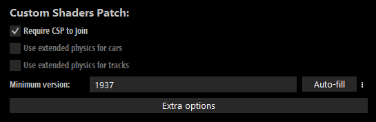

如果你想要求其他 CSP 版本但不知道从哪里获取 ID，请阅读这个 [FAQ 小节](./faq.md#requiring-csp-version)。  

要禁用版本要求，请确保 `Require CSP to join` 已禁用，然后点击 `Folder`（文件夹）按钮，打开 `extra_cfg.yml` 移除默认版本：
   ```yaml title="extra_cfg.yml"
   # Override minimum CSP version required to join this server. Leave this empty to not require CSP.
   MinimumCSPVersion: 
   ```

点击 `Extra Options` 按钮，把你想要使用的 CSP Extra Options 粘贴进去。

  </TabItem>
</Tabs>

[CSP Wiki](https://github.com/ac-custom-shaders-patch/acc-extension-config/wiki/Misc-%E2%80%93-Server-extra-options) 列出了大量可用的选项和设置。  
下面列出了其中对自由漫游服务器比较有用的两项。

```ini title="csp_extra_options.ini"
 [EXTRA_RULES]
 ALLOW_WRONG_WAY = 1   ; Allow cars to drive either way, gets rid of the wrong way sign on some tracks

 [PITS_SPEED_LIMITER]
 DISABLE_FORCED = 0    ; Disable forced pits speed limiter
 KEEP_COLLISIONS = 0   ; Activate collisions between cars in pits
 SPEED_KMH = 120       ; Alter pits speed limiter value; default is 80
```

#### 传送与改色的额外步骤 {#csp-extra-steps}

传送和改色还需要一些额外步骤：

<Tabs groupId="install-method" className="hidden-tab-labels">
  <TabItem value="folder" label="专用文件夹">

1. 导航到 `cfg` 文件夹，打开 `entry_list.ini`。

2. 每辆车都有一行 `SKIN=`，需要对其进行编辑才能让该车辆使用这些功能。  
   需要把以下代码添加到涂装行末尾：

   | 代码    | 用途                     |
   | ------- | ----------------------- |
   | `/ACA3` | 允许传送                  |
   | `/ABAH` | 允许改色                  |
   | `/ADAn` | 同时允许改色和传送          |

   这**不是**所有可用代码和选项的完整列表，只是其中一些最常用的。

   也就是说，如果我们想使用传送和改色，应该像这样：

   ```ini title="entry_list.ini"
   [CAR_0]
   MODEL=ruf_yellowbird
   // highlight-next-line
   SKIN=00_yellowbird_black/ADAn
   ```

   如果还想让我们的 AI 车辆以不同颜色生成，至少要给每辆车的涂装行加上 `/ABAH`，因为我们并不在乎它们能否传送。

3. 现在我们可以向 `csp_extra_options.ini` 文件添加选项了。

   于是，加上改色和传送后，文件如下所示：

   ```ini title="csp_extra_options.ini"
   [EXTRA_RULES]
   ALLOW_WRONG_WAY = 1   ; Allow cars to drive either way, gets rid of the wrong way sign on some tracks

   [PITS_SPEED_LIMITER]
   DISABLE_FORCED = 0    ; Disable forced pits speed limiter
   KEEP_COLLISIONS = 0   ; Activate collisions between cars in pits
   SPEED_KMH = 120       ; Alter pits speed limiter value; default is 80

   [CUSTOM_COLOR]
   ALLOW_EVERYWHERE = 1   ; change car colors anywhere as long as the car is stopped.

   [TELEPORT_DESTINATIONS]
   POINT_1 = Position 1
   POINT_1_GROUP = Shibaura PA
   ...
   ```

   官方 Shutoko Revival Project 服务器使用的传送点可以在[这个 FAQ 小节](./faq.md#srp-teleports)中找到

4. 保存并关闭文件，然后重启服务器。现在你可以通过聊天应用中的灯泡图标传送 / 更改车色，车流也会呈现随机颜色。  

   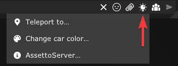

  </TabItem>
  <TabItem value="cm" label="在 Content Manager 内">

1. 打开预设的 `ENTRY LIST` 标签页。

2. 点击 `CSP` 按钮，勾选你想为该车辆启用的功能：  

   

3. 于是，加上改色和传送后，弹出窗口如下所示：

   ```ini title="Extra Options"
   [EXTRA_RULES]
   ALLOW_WRONG_WAY = 1   ; Allow cars to drive either way, gets rid of the wrong way sign on some tracks

   [PITS_SPEED_LIMITER]
   DISABLE_FORCED = 0    ; Disable forced pits speed limiter
   KEEP_COLLISIONS = 0   ; Activate collisions between cars in pits
   SPEED_KMH = 120       ; Alter pits speed limiter value; default is 80

   [CUSTOM_COLOR]
   ALLOW_EVERYWHERE = 1   ; change car colors anywhere as long as the car is stopped.

   [TELEPORT_DESTINATIONS]
   POINT_1 = Position 1
   POINT_1_GROUP = Shibaura PA
   ...
   ```

   官方 Shutoko Revival Project 服务器使用的传送点可以在[这个 FAQ 小节](./faq.md#srp-teleports)中找到

4. 关闭弹窗，在预设上点击 `Save` 和 `Restart`。现在你可以通过聊天应用中的灯泡图标传送 / 更改车色，车流也会呈现随机颜色。  

   
  </TabItem>
</Tabs>

### AssettoServer 插件 {#enabling-plugins}

AssettoServer 自带一些免费使用的插件，我们来看看如何启用并配置其中两个：  
[AutoModerationPlugin](./plugins/AutoModerationPlugin.mdx) 和 [RandomWeatherPlugin](./plugins/RandomWeatherPlugin.mdx)。  
你想添加多少插件都可以，只需务必仔细阅读[文档页面](./category/plugins)，因为某些插件可能有特定要求，或无法与其他插件共存。  
你可以一次启用并配置多个插件，以减少重启服务器的次数。  
不过，像我们这样逐个配置的好处是，一旦出了问题更容易找到原因。

:::caution
编辑插件配置时，注意保持格式完好。每行的缩进都很重要，缩进错误会导致服务器崩溃。
:::

<Tabs groupId="install-method">
  <TabItem value="folder" label="专用文件夹">

{/*EMPTY VISIBLE TAB TO CONTROL BOTH PLUGIN SECTIONS*/}

  </TabItem>
  <TabItem value="cm" label="在 Content Manager 内">

{/*EMPTY VISIBLE TAB TO CONTROL BOTH PLUGIN SECTIONS*/}

  </TabItem>
</Tabs>

#### AutoModerationPlugin

<Tabs groupId="install-method" className="hidden-tab-labels">
  <TabItem value="folder" label="专用文件夹">

1. 导航到服务器的 `cfg` 文件夹，打开 `extra_cfg.yml`。

  </TabItem>
  <TabItem value="cm" label="在 Content Manager 内">

1. 点击 `Folder`（文件夹）按钮，打开 `extra_cfg.yml`。

  </TabItem>
</Tabs>


2. 找到 `EnablePlugins:` 并启用该插件：
   ```yaml title="extra_cfg.yml"
   # List of plugins to enable
   EnablePlugins:
     - AutoModerationPlugin
   ```

3. 保存文件并启动一次服务器，以生成插件配置文件。

4. 打开此时应已出现在 `extra_cfg.yml` 旁边的 `plugin_auto_moderation_cfg.yml`。  
   将你想要的功能设为 `Enabled: true` 并保存文件，它应该类似这样： 
   ```yml title="plugin_auto_moderation_cfg.yml"
   # yaml-language-server: $schema=schemas\plugin_auto_moderation_cfg.schema.json

   # Kick players that are AFK
   AfkPenalty:
     # Set to true to enable
     Enabled: true
     # Don't kick if at least one open slot of the same car model is available
     IgnoreWithOpenSlots: true
     # Time after the player gets kicked. A warning will be sent in chat one minute before this time
     DurationMinutes: 10
     # Set this to MinimumSpeed to not reset the AFK timer on chat messages / controller inputs and require players to actually drive
     Behavior: PlayerInput
   # Kick players with a high ping
   HighPingPenalty:
     # Set to true to enable
     Enabled: true
     # Time after the player gets kicked. A warning will be sent in chat after half this time
     DurationSeconds: 20
     # Players having a lower ping will not be kicked
     MaximumPingMilliseconds: 500
   # Penalise players driving the wrong way. AI has to enabled for this to work
   WrongWayPenalty:
     # Set to true to enable
     Enabled: true
     # Time after the player gets kicked. A warning will be sent in chat after half this time
     DurationSeconds: 20
     # Players driving slower than this speed will not be kicked
     MinimumSpeedKph: 20
     # The amount of times a player will be send to pits before being kicked
     PitsBeforeKick: 2
   # Penalise players driving without lights during the night
   NoLightsPenalty:
     # Set to true to enable
     Enabled: true
     # Time in which no warning or signs will be sent
     IgnoreSeconds: 2
     # Time after the player gets kicked. A warning will be sent in chat after half this time
     DurationSeconds: 60
     # Players driving slower than this speed will not be kicked
     MinimumSpeedKph: 20
     # The amount of times a player will be send to pits before being kicked
     PitsBeforeKick: 2
   # Penalise players blocking the road. AI has to be enabled for this to work
   BlockingRoadPenalty:
     # Set to true to enable
     Enabled: true
     # Time after the player gets kicked. A warning will be sent in chat after half this time
     DurationSeconds: 30
     # Players driving faster than this speed will not be kicked
     MaximumSpeedKph: 5
     # The amount of times a player will be send to pits before being kicked
     PitsBeforeKick: 2
   ```
   如果愿意，我们现在可以进一步调整插件配置，但暂且保持原样。

#### RandomWeatherPlugin

<Tabs groupId="install-method" className="hidden-tab-labels">
  <TabItem value="folder" label="专用文件夹">

1. 导航到服务器的 `cfg` 文件夹，打开 `extra_cfg.yml`。

  </TabItem>
  <TabItem value="cm" label="在 Content Manager 内">

1. 点击 `Folder`（文件夹）按钮，打开 `extra_cfg.yml`。

  </TabItem>
</Tabs>

2. 找到 `EnablePlugins:` 并像这样启用该插件：
   ```yaml title="extra_cfg.yml"
   # List of plugins to enable
   EnablePlugins:
     - AutoModerationPlugin
     - RandomWeatherPlugin
   ```

3. 保存文件并启动一次服务器，以生成插件配置文件。

4. 打开此时应已出现在 `extra_cfg.yml` 旁边的 `plugin_random_weather_cfg.yml`。  
   我们将编辑 `WeatherWeights`，只保留 `Clear`、`FewClouds`、`ScatteredClouds`、`BrokenClouds` 和 `OvercastClouds`，如下所示：
   ```yaml title="plugin_random_weather_cfg.yml"
   # yaml-language-server: $schema=schemas\plugin_random_weather_cfg.schema.json

   # Weights for random weather selection, setting a weight to 0 blacklists a weather, default weight is 1
   WeatherWeights:
     LightThunderstorm: 0
     Thunderstorm: 0
     HeavyThunderstorm: 0
     LightDrizzle: 0
     Drizzle: 0
     HeavyDrizzle: 0
     LightRain: 0
     Rain: 0
     HeavyRain: 0
     LightSnow: 0
     Snow: 0
     HeavySnow: 0
     LightSleet: 0
     Sleet: 0
     HeavySleet: 0
     Clear: 1
     FewClouds: 1
     ScatteredClouds: 1
     BrokenClouds: 1
     OvercastClouds: 1
     Fog: 0
     Mist: 0
     Smoke: 0
     Haze: 0
     Sand: 0
     Dust: 0
     Squalls: 0
     Tornado: 0
     Hurricane: 0
     Cold: 0
     Hot: 0
     Windy: 0
     Hail: 0
   # Minimum duration until next weather change
   MinWeatherDurationMinutes: 5
   # Maximum duration until next weather change
   MaxWeatherDurationMinutes: 30
   # Minimum weather transition duration
   MinTransitionDurationSeconds: 120
   # Maximum weather transition duration
   MaxTransitionDurationSeconds: 600
   ```
5. 保存并关闭文件，然后重启服务器。  

如果一切操作正确，你会在服务器日志的开头看到两行新内容：  

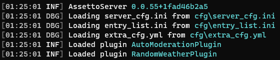  

以上就是启用和配置插件的方法。  

### 故障排查基础 {#troubleshooting}

如果某个时候出了问题，服务器无法正常启动，有几种方法可以找出问题所在并修复它。
在这个例子中，我们将查看一种较常见的服务器崩溃原因，但学会该看些什么，能帮你解决任何问题。

:::note
如果你尝试启动服务器时终端窗口直接关闭了，`logs` 文件夹中总会有服务器日志文件，`crash` 文件夹中总会有崩溃日志文件可供阅读！  
:::

服务器日志会生成在服务器的 `logs` 文件夹中。
日志文件名形如 `log-20230706.txt`，其中 `log-` 之后的部分是写入日志的日期。

在继续之前，我想先解释几点有助于减少阅读量的内容。  
日志的每一行开头都会有一些信息：`YEAR-MONTH-DAY HR:MIN:SEC.MILS TIMEZONE(+/- UTC) [TYPE]`  
我们真正关心的只有类型和实际消息，这里有一份简表：

| 消息类型 | 含义                                                   |
| -------- | ----------------------------------------------------- |
| `[DBG]`  | 调试（Debug），可以忽略                                  |
| `[INF]`  | 信息（Information），同样可以忽略                          |
| `[WRN]`  | 警告（Warning），可能重要，但通常也可以忽略                  |
| `[ERR]`  | 错误（Error），服务器可以从中恢复并继续运行。                |
| `[FTL]`  | 致命（Fatal），导致服务器终止的错误。                       |

虽然 `[INF]`、`[DBG]` 和 `[WRN]` 中可能藏有其他问题的线索，但在我们的例子中，我们将重点关注 `[ERR]` 和 `[FTL]` 消息。

#### 示例 #1 - 缺少 AI 行驶线路 {#missing-aispline}

现在，请你查看下图中的日志，试着读一读，直到找到可能揭示服务器崩溃原因的线索。  

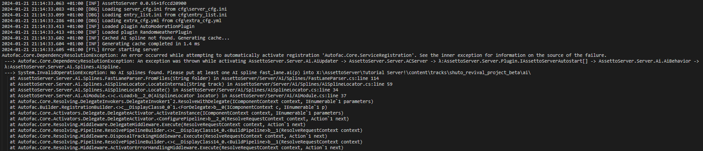

乍一看这可能是一大段吓人的文字，即使把范围缩小到 `[FTL]` 消息，这种感觉也不会改变。  
但只要真正去读上几行，我们就能发现一些看得懂的内容：  

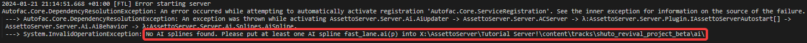

这一行告诉了我们所需的一切，所以其余消息可以忽略。

`No ai folder found. Please put at least one AI spline fast_lane.ai(p) into \content\tracks\shuto_revival_project_beta\ai\`

显然，我们没能把 AI 行驶线路放进正确的文件夹。  
把 `fast_lane.aip` 移动到日志消息显示的文件夹中（必要时先创建该文件夹），即可消除此错误，服务器应该就能正常启动了。

#### 示例 #2 - 配置文件语法错误 {#syntax-errors}

既然我们之前启用并配置了一些插件，那就来看一个与之相关的例子。  

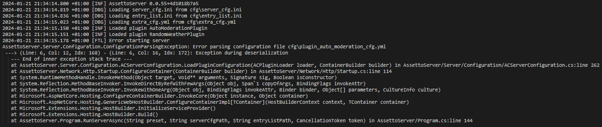

虽然它看起来大不相同，也不像之前那样提供一条告诉我们该怎么做的有用消息，但其实很好理解。
`Error parsing configuration file cfg\plugin_auto_moderation_cfg.yml --> (Line: 6, Col: 16, Idx: 172)`  
从这一行可以看出，解析 `plugin_auto_moderation_cfg.yml` 文件时出了问题。  
那么让我们打开 `plugin_auto_moderation_cfg.yml`，看看第 `6` 行

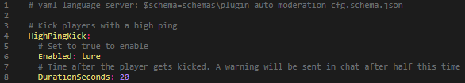

乍一看，尤其当你使用的文本编辑器没有语法高亮时，这里似乎毫无问题。  
但仔细一看，我们发现启用 `HighPingKick` 时打错了字；把 `Enabled: ture` 改正为 `Enabled: true` 并保存文件，即可消除此错误，服务器应该就能正常启动了。

## 更新服务器 {#updating-the-server}

一般来说，更新 AssettoServer 时建议从头开始，而不是简单地覆盖文件。  

1. 备份你当前的服务器文件，并下载[最新版本](./thebeginnersguide.md#latest-assettoserver-version)（或你想更新到的版本）。

2. 为更新后的服务器新建一个文件夹，并按照[之前这一小节](./thebeginnersguide.md#server-extraction)的说明解压新的 AssettoServer 文件。

3. 从旧服务器中，只复制和复用那些不是 `extra_cfg.yml` 或 `plugin_<plugin_name>_config.yml` 的文件。

4. 运行一次更新后的 `AssettoServer.exe`，生成一份更新后的 `extra_cfg.yml`。

5. 参照旧 `extra_cfg.yml` 的备份，重新配置更新后服务器的 `extra_cfg.yml`。

6. 如果你启用过任何插件，请重启一次更新后的服务器以生成新的插件配置文件，然后重新配置它们。

:::note
`extra_cfg.yml` 和插件配置文件中的参数可能随版本变化。  
如果你用旧版本的文件覆盖，或手动更改 / 恢复参数，服务器可能会停止工作。
:::

## 如何寻求帮助 {#asking-for-help}

如果你遇到了问题或自己无法解决的麻烦，欢迎加入 AssettoServer Discord 寻求帮助。  
不过在此之前，请务必先阅读[简介](./intro.mdx)、[FAQ](./faq.md) 和[常见配置错误](./common-configuration-errors.md)页面，它们回答了大量常见问题。

:::caution
如果你在搭建服务器方面需要帮助，请使用 #server-troubleshooting。  
在 #bug-reports 或 #general 中发布你的问题，通常会导致消息被无视或删除。
:::

### 帮我们更好地帮你 {#help-us-help-you}

#### 使用搜索功能。

  你遇到的问题，很可能别人也遇到过，并且已经问过怎么解决。  
  虽然 Discord 的搜索功能并不以好用著称，但它仍应能给你一些可以通读的结果，看看你的问题能否用同样的方式解决。  

  在 [#server-troubleshooting](https://discord.com/channels/890676433746268231/921759366183534622) 频道中按 `CTRL + F` 可以把搜索范围缩小到该频道。  
  然后输入简短的关键词，比如某条错误消息的开头一句。  
  接着浏览搜索结果，看看是否有与你在找的内容相符的。  
  如果找到想仔细查看的消息，把鼠标悬停在消息上并点击 `Jump`（跳转）按钮。  

  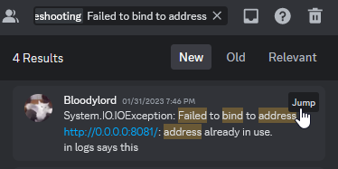  

  你会跳转到消息发送的时间点，从而通读完整的聊天记录。  
  如果没有搜索结果，或者对话中提到的内容都没能解决你的问题，也可以尝试跳转到其他消息，或去掉 `in:#server-troubleshooting` 来搜索整个 Discord。  
  如果这一切都不奏效，你就可以着手撰写自己的消息了。

#### 不要"询问是否可以提问"。 
   > 嘿，有人能帮帮我吗？

   这类消息通常无人回应，因为它也可以被理解为：
   > 我有个问题，但除非频道里有人愿意花时间回答，否则我懒得把它组织成文字。

    解决办法不是询问是否可以提问，而是直接提问。在频道里闲逛、只是偶尔瞄一眼动静的人，不太可能回应你"询问是否可以提问"的问题；但如果你切实描述了自己的问题，他们就可能回复你，因为你（希望如此）已经提供了他们帮助你所需的全部信息。

#### 尽可能多地提供信息，并排版得易于阅读。
   > 服务器崩溃了，救命，怎么办？

   这和"询问是否可以提问"一样糟糕，因为别人为了缩小问题范围，不得不反过来向你索要更多细节。  
   试着说明问题本身，以及你已经尝试过哪些方法来解决它。  
   上传服务器 `crash` 文件夹中的 `crash_XXXXXXXX_XXXXXX.txt`，附上服务器崩溃日志。  
   文件截图可能遗漏重要信息，而且通常更难阅读。  
   如果只想复制几行内容，请使用 Discord 的 markdown 功能把它放进代码块，以便阅读。  
   具体做法是用 ` ``` ` 包围内容，像这样：` ```Text``` `

   一些易于阅读的示例消息：

   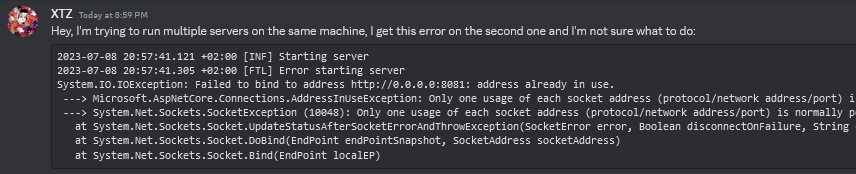

   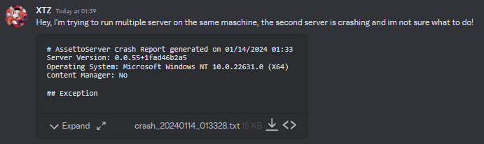
